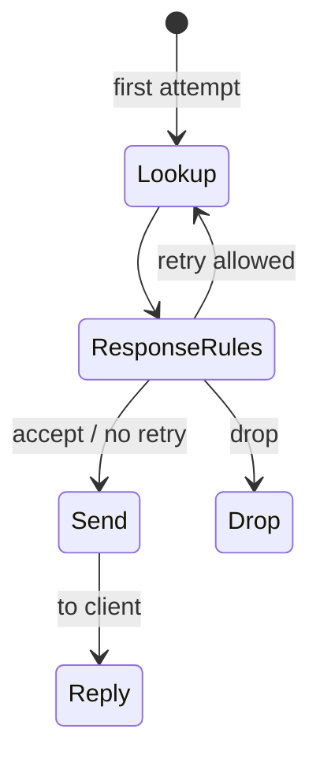

# Retries and transactions

This page explains how Conduit handles **retries** — sending the same client [transaction](/glossary/index.md#transaction) through [Lookup](/concepts/architecture-and-packet-path.md#lookup) again after an upstream answer or timeout — and the **global limits** that stop further attempts. For declarative actions, see [Rules and actions](/policy-routing/rules-and-actions.md). For the full query path, see [Architecture and packet path](/concepts/architecture-and-packet-path.md).

## Overview

A [transaction](/glossary/index.md#transaction) is everything Conduit remembers for one client query from [Receive](/concepts/architecture-and-packet-path.md#receive) through [Send](/concepts/architecture-and-packet-path.md#send) or drop. Retries reuse that same transaction: the original question, client address, [tags](/glossary/index.md#tags), and request-side [pool](/glossary/index.md#pool) choice stay in place unless policy changes them on a later hook.

**Only [Response rules](/concepts/architecture-and-packet-path.md#response-rules)** (built-in actions or [Rhai](/rhai/index.md) on the response hook) can trigger a retry. [Request rules](/concepts/architecture-and-packet-path.md#request-rules) run **once** at the start of the transaction; they do not run again when Conduit re-enters at [Lookup](/concepts/architecture-and-packet-path.md#lookup).

When policy requests a retry, Conduit jumps from [Response rules](/concepts/architecture-and-packet-path.md#response-rules) back to [Lookup](/concepts/architecture-and-packet-path.md#lookup), runs the **full provider chain** again (subject to [cache eligibility](/guides/dns-answer-cache.md#cache-eligibility)), picks an **eligible** [backend](/glossary/index.md#backend) in the target [pool](/glossary/index.md#pool) (see [Backend selection on retries](#backend-selection-on-retries)), and forwards again when the forward provider runs. When limits are reached, every eligible [backend](/glossary/index.md#backend) in the target pool was already tried, or policy accepts the outcome, Conduit continues to [Send](/concepts/architecture-and-packet-path.md#send) and replies to the client.



## Requesting a retry

**Retry intent** comes from a matching response rule or [Rhai](/rhai/index.md) script on the response hook:

| Mechanism | Pool for the next attempt |
|-----------|---------------------------|
| **`retry`** or **`retry_now`** action (response) | Uses **`selected_pool`** on the next retry Lookup — the pool from the last forward attempt on this transaction (see [Pool selection lifecycle](#pool-selection-lifecycle)) |
| **`set_retry_pool`** + **`retry`** or **`retry_now`** (either hook for `set_retry_pool`; response for retry) | Uses `retry_pool` on the next retry Lookup if retry occurs |
| **`txn.request_retry()`** or **`txn.request_retry_now()`** in Rhai (response) | Same as **`retry`** / **`retry_now`** — stay in the current pool |
| **`txn.set_retry_pool("name")`** in Rhai | Pool for retry Lookup if retry occurs; first forward ignores (both hooks) — pair with **`txn.request_retry()`** on the response hook to fail over |
| **`set_retry_source_v4`** / **`set_retry_source_v6`** + **`retry`** (request or response for source; response for retry) | One-shot egress bind on the **next retry forward** only — see [Source selection lifecycle](#source-selection-lifecycle) |
| **`txn.set_retry_source_v4(addr)`** / **`txn.set_retry_source_v6(addr)`** in Rhai | Same as **`set_retry_source_*`** — does not trigger retry; pair with **`txn.request_retry()`** on the response hook |

At forward **route** inside Lookup, when `attempt_count > 0` (retry re-entry), Conduit uses `retry_pool` if set (then clears it), then falls back to `selected_pool`, then the default pool. On the **first** forward (`attempt_count == 0`), `retry_pool` is ignored. Full lifecycle: [Pool selection lifecycle](#pool-selection-lifecycle).

[Response rules](/concepts/architecture-and-packet-path.md#response-rules) run after an upstream answer **or** after a forward **timeout** (still with no stored answer). That lets you retry on **SERVFAIL**, **NXDOMAIN**, slow upstreams, and other conditions you express with [selectors](/glossary/index.md#selector) such as `rcode`.

### Declarative examples

Fail over to another pool on **SERVFAIL**:

```yaml
orchestrator:
  max_attempts: 3
  max_txn_duration_ms: 5000

pools:
  - name: primary
    backends:
      - address: "10.0.0.1:53"
  - name: secondary
    backends:
      - address: "10.0.0.2:53"

rules:
  match_mode: first_match
  rules:
    - name: use-primary
      hook: request
      selectors:
        - type: qname_suffix
          value: ".example."
      actions:
        - type: set_pool
          value: primary
    - name: servfail-retry-other-pool
      hook: response
      selectors:
        - type: rcode
          value: SERVFAIL
      actions:
        - type: set_retry_pool
          value: secondary
        - type: retry
```

Retry within the same pool (try another [backend](/glossary/index.md#backend) in that pool):

```yaml
pools:
  - name: primary
    backends:
      - address: "10.0.0.1:53"
      - address: "10.0.0.2:53"
      - address: "10.0.0.3:53"

rules:
  match_mode: first_match
  rules:
    - name: servfail-retry-same-pool
      hook: response
      selectors:
        - type: rcode
          value: SERVFAIL
      actions:
        - type: retry
```

On **SERVFAIL**, Conduit re-enters at [Lookup](/concepts/architecture-and-packet-path.md#lookup). With **`set_retry_pool`** + **`retry`**, the next forward uses that pool’s [backends](/glossary/index.md#backend). With **`retry`** alone, Conduit keeps the pool from the first attempt and selects a different backend there when more than one is configured.

### Rhai

On the response hook:

- **`txn.request_retry()`** — soft retry in the current pool (same as **`retry`** in YAML).
- **`txn.request_retry_now()`** — hard retry in the current pool (same as **`retry_now`** in YAML).
- **`txn.set_retry_pool("pool-name")`** — pool for retry Lookup if retry occurs; first forward [Route](/concepts/architecture-and-packet-path.md#route) ignores. Add **`txn.request_retry()`** or **`txn.request_retry_now()`** to trigger failover.

See [Transaction API — Outcomes](/rhai/txn-api.md#outcomes) (`request_retry`, `request_retry_now`) and [Routing](/rhai/txn-api.md#routing) (`set_retry_pool`).

## What happens on each attempt

When the forward provider reaches [Route](/concepts/architecture-and-packet-path.md#route) inside [Lookup](/concepts/architecture-and-packet-path.md#lookup):

1. **Pool selection** — see [Pool selection lifecycle](#pool-selection-lifecycle) below.
2. **Backend selection** — see [Backend selection on retries](#backend-selection-on-retries).
3. **Attempt counter** — Conduit increments the attempt count for this transaction before [Forward](/concepts/architecture-and-packet-path.md#forward).

[`conduit_queries_by_pool_total`](/observability/built-in-metrics.md#conduit_queries_by_pool_total) increments for **each** attempt that reaches [Route](/concepts/architecture-and-packet-path.md#route) → [Forward](/concepts/architecture-and-packet-path.md#forward) inside Lookup, including retries.

[Tags](/glossary/index.md#tags) set on [request rules](/concepts/architecture-and-packet-path.md#request-rules) or earlier [response rules](/concepts/architecture-and-packet-path.md#response-rules) **persist** across retries unless a script clears them. You can branch later rules on tags (for example “already retried”).

### Pool selection lifecycle { #pool-selection-lifecycle }

Each [transaction](/glossary/index.md#transaction) carries two pool-related fields set by policy:

| Field | Set by | Role |
|-------|--------|------|
| **`selected_pool`** | **`set_pool`** / **`txn.set_pool`**, request rules, or default pool | Primary pool for routing |
| **`retry_pool`** | **`set_retry_pool`** / **`txn.set_retry_pool`** | Optional **one-shot** override for the **next** retry [Route](/concepts/architecture-and-packet-path.md#route) only |

At each [Route](/concepts/architecture-and-packet-path.md#route), Conduit resolves the pool name, picks a [backend](/glossary/index.md#backend), then **updates `selected_pool`** to the pool that attempt actually used. That update matters on later retries: after a cross-pool failover, **`selected_pool`** reflects the failover pool even though request rules originally chose another name.

**First attempt** (`attempt_count == 0` before Route):

- Uses **`selected_pool`** (from request policy or default). **`retry_pool` is ignored**, even if stashed on the request hook.

**Retry re-entry** (`attempt_count > 0`):

- If **`retry_pool`** is set → use that name for this attempt, then **clear** it (consumed).
- Else → use **`selected_pool`** (the pool from the last successful Route on this transaction).
- Else → default pool.

So **`retry_pool` is not a standing “retry target” for every subsequent attempt.** You do **not** need to call **`set_retry_pool`** again on each response pass just to **stay** on a pool you already failed over to — after the one-shot stash is consumed, later retries follow **`selected_pool`**, which Route already updated to that pool.

**When to set `retry_pool` again:**

- You want a **different** pool on the **next** retry than **`selected_pool`** would give (for example tertiary after secondary).
- You called **`clear_retry_pool`** / **`txn.clear_retry_pool()`** and later need a new override.
- Response policy sets a fresh stash on each response pass that requests retry (unusual; only when each retry should honor a newly chosen override).

**Worked example** — request rule sets **`set_pool: primary`** and **`set_retry_pool: secondary`**, response rule retries on **SERVFAIL**:

| Step | `attempt_count` before Route | `retry_pool` | `selected_pool` before Route | Pool used |
|------|------------------------------|--------------|------------------------------|-----------|
| First Route | 0 | secondary (ignored) | primary | **primary** |
| Response: retry | — | secondary (unchanged) | primary | — |
| Second Route | 1 | secondary → cleared | primary | **secondary** |
| Response: retry again (no new `set_retry_pool`) | — | — | secondary (updated at Route) | — |
| Third Route | 2 | — | secondary | **secondary** |

Further retries in **secondary** use another backend there when available; they do **not** snap back to **primary** unless policy changes **`selected_pool`** or stashes a new **`retry_pool`**.

Rhai reference: [Transaction API — Routing](/rhai/txn-api.md#routing). Pipeline detail: [Architecture — Route](/concepts/architecture-and-packet-path.md#route).

### Source selection lifecycle { #source-selection-lifecycle }

Egress bind IP is separate from pool choice. Each [transaction](/glossary/index.md#transaction) carries up to four egress-related fields:

| Field | Set by | Role |
|-------|--------|------|
| **`source_override_v4`** / **`source_override_v6`** | **`set_source_v4`** / **`set_source_v6`** or Rhai **`txn.set_source_*`** (request hook only) | Standing local bind for **every** forward attempt (unless retry source wins on that attempt) |
| **`retry_source_override_v4`** / **`retry_source_override_v6`** | **`set_retry_source_*`** / **`txn.set_retry_source_*`** (request or response hook) | Optional **one-shot** bind for the **next retry forward only** |

At each [Forward](/concepts/architecture-and-packet-path.md#forward), after `attempt_count` is incremented for this attempt:

**First forward** (`attempt_count == 1` at Forward):

- **`retry_source_override_*` is ignored**, even if stashed on the request or an earlier response pass.
- Uses standing **`source_override_*`** if set, else pool/global round-robin among configured sources.

**Retry forward** (`attempt_count > 1` at Forward):

- If **`retry_source_override_*`** is set for the backend’s address family → use it **once**, then **clear** it (consumed).
- Else → standing **`source_override_*`** if set.
- Else → pool/global round-robin.

**`set_retry_source_*` does not trigger retry** and does not affect the first upstream attempt. Pair with **`retry`** / **`retry_now`** or Rhai **`txn.request_retry()`** when outcome-driven failover should use a different bind IP. **`clear_retry_source_*`** removes the stash without clearing standing **`set_source_*`** overrides.

**Worked example** — request rule sets **`set_source_v4: 127.0.0.1`** and **`set_retry_source_v4: 10.0.0.5`**, response rule retries on **SERVFAIL**:

| Step | `attempt_count` at Forward | `retry_source_override_v4` | Bind used (v4 backend) |
|------|----------------------------|----------------------------|------------------------|
| First forward | 1 | 10.0.0.5 (stashed) | **127.0.0.1** (standing; stash ignored) |
| Response: retry | — | — | — |
| Second forward | 2 | consumed → cleared | **10.0.0.5** (one-shot retry source) |
| Third forward (if any) | 3 | — | **127.0.0.1** (standing again) |

Allowed-set enforcement at Forward is unchanged. See [Dual-stack forwarding](/guides/dual-stack-forwarding.md#choosing-an-egress-source) and [Transaction API — Egress](/rhai/txn-api.md#egress).

### Backend selection on retries

| Attempt | Behavior |
|---------|----------|
| **First** (`attempt_count` 0 before [Route](/concepts/architecture-and-packet-path.md#route)) | Sticky weighted pick among **eligible** [backends](/glossary/index.md#backend) in the pool — same as normal [Pools and backends](/policy-routing/pools-and-backends.md) load balancing |
| **Retry** (`attempt_count` > 0) | Weighted pick among **eligible** [backends](/glossary/index.md#backend) in the **target pool** that were **not** already used for that pool on this [transaction](/glossary/index.md#transaction) |

**Eligible** means every configured backend when pool [health](/policy-routing/backend-health.md) is off, and backends whose **[applied](/glossary/index.md#applied-health)** health is **up** when health is on (plus any [fail-open](/glossary/index.md#fail-open-floor) treatment). Retries never prefer a backend that Route would skip on the first attempt.

On a cross-pool retry, only backends tried **in the target pool** are excluded — backends used in other pools do not count.

When every eligible backend in the target pool was already tried (or none are eligible), [Route](/concepts/architecture-and-packet-path.md#route) cannot select another backend. Conduit sets **SERVFAIL** and moves to [Send](/concepts/architecture-and-packet-path.md#send) (pool exhausted for this transaction).

A pool with only one [backend](/glossary/index.md#backend) cannot offer an alternate target on retry; the next retry attempt hits pool exhaustion immediately after the first forward fails.

## Global limits (`orchestrator`) { #global-limits-orchestrator }

The top-level **`orchestrator:`** block caps how long a transaction may loop and how many [Lookup](/concepts/architecture-and-packet-path.md#lookup) forward attempts are allowed. Field reference: [Reference: orchestrator](/reference/config-schema/orchestrator.md). When omitted, Conduit uses the same defaults as in [Minimal configuration](/getting-started/minimal-configuration.md).

| Field | Default | Meaning |
|-------|---------|---------|
| `max_attempts` | **3** | Maximum forward-provider [Route](/concepts/architecture-and-packet-path.md#route) → [Forward](/concepts/architecture-and-packet-path.md#forward) cycles inside Lookup for one client query |
| `max_txn_duration_ms` | **5000** | Wall-clock limit for the whole transaction from start to [Send](/concepts/architecture-and-packet-path.md#send) or drop |
| `txn_table_capacity` | **1024** | Capacity for tracking in-flight transactions on the [dataplane](/glossary/index.md#dataplane) (not per-query retry count) |

Conduit checks **`max_txn_duration_ms`** and **`max_attempts`** before each forward attempt inside [Lookup](/concepts/architecture-and-packet-path.md#lookup). When either limit is exceeded, Conduit sets **SERVFAIL** on the transaction and moves to [Send](/concepts/architecture-and-packet-path.md#send) instead of forwarding again.

A retry stops when any of these occurs:

- **`max_attempts`** reached
- **`max_txn_duration_ms`** exceeded
- **Pool exhausted** — no unused **eligible** [backend](/glossary/index.md#backend) left in the target pool for this [transaction](/glossary/index.md#transaction)
- Policy accepts the answer (no retry intent on [Response rules](/concepts/architecture-and-packet-path.md#response-rules))

Validation: `max_attempts` must be **≥ 1**.

### What the client sees when limits hit

When retries are exhausted, the pool is exhausted, or the transaction runs too long, the client receives a **synthesized SERVFAIL** (unless an upstream wire answer was already stored and policy sends the pipeline to [Send](/concepts/architecture-and-packet-path.md#send) without another retry). Synthesized errors echo the question section from the original query. Details: [Send](/concepts/architecture-and-packet-path.md#send) in [Architecture and packet path](/concepts/architecture-and-packet-path.md).

You can adjust response metadata before [Send](/concepts/architecture-and-packet-path.md#send) with the **`set_rcode`** action on [response rules](/policy-routing/rules-and-actions.md) when policy accepts the answer instead of retrying.

## Observability

| Signal | When |
|--------|------|
| [`conduit_retries_total{pool}`](/observability/built-in-metrics.md#conduit_retries_total) | [Response rules](/concepts/architecture-and-packet-path.md#response-rules) send the pipeline back to [Lookup](/concepts/architecture-and-packet-path.md#lookup); `pool` is the **target** pool for the next attempt |
| [`conduit_queries_by_pool_total{pool}`](/observability/built-in-metrics.md#conduit_queries_by_pool_total) | Each attempt that reaches [Forward](/concepts/architecture-and-packet-path.md#forward), including retries |
| Event export **`retry`** frames | When sinks are configured with retry emission — see [Event export](/observability/event-export.md) |

## Related topics

- [Rules and actions](/policy-routing/rules-and-actions.md) — `retry`, `retry_now`, `set_retry_pool`, `set_rcode`, response [selectors](/glossary/index.md#selector)
- [Declarative failover](/guides/declarative-failover.md) — end-to-end SERVFAIL / timeout failover lab
- [Rule action order](/guides/rule-action-order.md) — soft vs hard drop/retry; request stash on first Route
- [Pools and backends](/policy-routing/pools-and-backends.md) — pool names, weights, default pool
- [Backend health](/policy-routing/backend-health.md) — eligibility and fail-open at [Route](/concepts/architecture-and-packet-path.md#route)
- [Architecture and packet path](/concepts/architecture-and-packet-path.md) — [Response rules](/concepts/architecture-and-packet-path.md#response-rules), [Send](/concepts/architecture-and-packet-path.md#send), timeouts
- [Rhai — Transaction API (Routing)](/rhai/txn-api.md#routing) — `txn.set_pool`, `txn.clear_pool`, `txn.set_retry_pool`, `txn.clear_retry_pool`
- [Rhai — Transaction API (Egress)](/rhai/txn-api.md#egress) — `txn.set_source_*`, `txn.set_retry_source_*`, `txn.clear_retry_source_*`
- [Built-in metrics](/observability/built-in-metrics.md) — counters, profiles, and pipeline mapping
