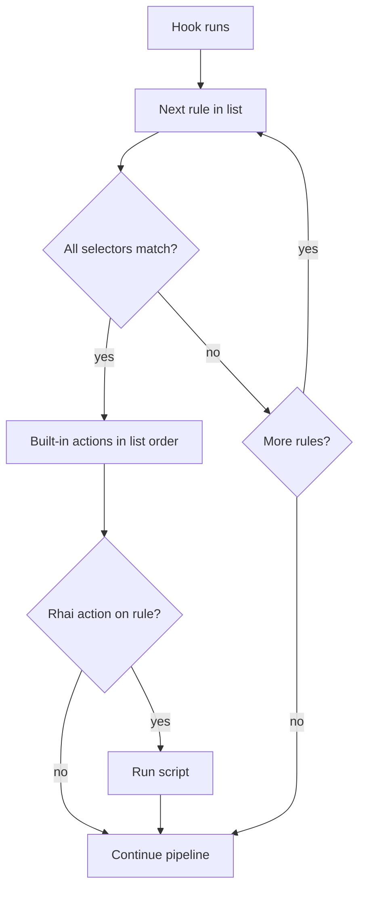

# Rules and actions

This page is the **behavioral home** for declarative policy in Conduit: how you declare rules under `rules:` in your [config file](/control-plane/config-file.md), what they can change on each query, and when they run on the [dataplane](/glossary/index.md#dataplane). For the query pipeline, see [Architecture and packet path](/concepts/architecture-and-packet-path.md). For [Rule Rhai](/glossary/index.md#rule-rhai), see [Rhai](/rhai/index.md). For planned [WASM](/glossary/index.md#wasm) and [sidecar](/glossary/index.md#sidecar) plugins, see [Planned plugin models](/concepts/planned-plugin-models.md).

## Overview

A **rule** is a named piece of policy with:

- A **hook** — `request` or `response` (the [Request rules](/concepts/architecture-and-packet-path.md#request-rules) or [Response rules](/concepts/architecture-and-packet-path.md#response-rules) phase)
- **[Selectors](/glossary/index.md#selector)** — conditions on the [transaction](/glossary/index.md#transaction) (query name, type, response code, [tags](/glossary/index.md#tags), …)
- **[Actions](/glossary/index.md#action)** — built-in effects when every selector on that rule matches

Rules live under the top-level **`rules:`** key. In current releases, **`match_mode: first_match`** is the only supported mode: on each hook, Conduit walks the rule list from top to bottom and stops at the **first** rule whose selectors all match. Later rules on that hook are skipped for that query. Other **`match_mode`** values may be supported in a future release; until then, only **`first_match`** is accepted at config load.

When **no** rule matches on the request hook, Conduit continues to [Route](/concepts/architecture-and-packet-path.md#route) with the default [pool](/glossary/index.md#pool) path ([Pools and backends](/policy-routing/pools-and-backends.md)). When no rule matches on the response hook, Conduit continues to [Send](/concepts/architecture-and-packet-path.md#send) with the upstream answer or error already on the transaction.



Minimal example — route internal `A` queries to a pool and pin egress:

```yaml
rules:
  match_mode: first_match
  rules:
    - name: internal-a
      hook: request
      selectors:
        - type: qtype
          value: A
      actions:
        - type: set_pool
          value: internal
        - type: set_source_v4
          value: "10.0.0.5"
```

Every field on `rules:`, selectors, and actions: [Reference: rules](/reference/config-schema/rules.md).

## When changes to rules take effect { #when-changes-to-rules-take-effect }

When you reload or apply configuration (**SIGHUP**, `conduitctl reload`, or `conduitctl apply`), Conduit validates the file (including rules and script paths) and loads the result into the active [runtime snapshot](/glossary/index.md#runtime-snapshot) for **later** queries.

Queries already in progress keep the rules they started with — they do not switch mid-query to a half-applied config. If validation fails, Conduit keeps the previous working snapshot and DNS keeps flowing. See [Configuration model](/control-plane/configuration-model.md).

## Action order on one rule { #action-order-on-one-rule }

**Actions on a single rule run in list order** (top to bottom). Order matters when multiple actions touch the same [transaction](/glossary/index.md#transaction) fields.

When you use **`set_pool`** and **`set_source_v4`** / **`set_source_v6`** on the **same** rule, list **`set_pool` first**, then the source action — so [Forward](/concepts/architecture-and-packet-path.md#forward) checks the override against the allowed addresses for the pool you just selected.

The selected [pool](/glossary/index.md#pool) can also come from an **earlier** matching rule or from the default pool when no rule sets one. At [Forward](/concepts/architecture-and-packet-path.md#forward), Conduit still requires the override to be in the **allowed set for that pool** (global `forward.sources_*` ∪ that pool’s `sources_*`). If the override is not allowed, Conduit **falls back to round-robin** among configured sources — same behavior as [Rhai](/rhai/index.md) `set_source_v4` / `set_source_v6`. See [Dual-stack forwarding](/guides/dual-stack-forwarding.md#choosing-an-egress-source).

## Request-hook actions

Use on `hook: request` — after [Parse](/concepts/architecture-and-packet-path.md#parse), before [Route](/concepts/architecture-and-packet-path.md#route).

| Action {: .column-no-wrap } | `value` | Effect |
|--------|---------|--------|
| `set_pool` | Pool name | Sets the target [pool](/glossary/index.md#pool) for [Route](/concepts/architecture-and-packet-path.md#route) |
| `set_tag` | `key=value` or `key` (→ `true`) | Sets a [tag](/glossary/index.md#tags) on the [transaction](/glossary/index.md#transaction) |
| `set_source_v4` | IPv4 address | Pins upstream egress to this local IPv4 address for this query |
| `set_source_v6` | IPv6 address | Pins upstream egress to this local IPv6 address for this query |
| `drop` | (ignored) | Ends the query with **no** DNS reply ([policy drop](/observability/built-in-metrics.md#policy-drops-no-built-in-counter)) |
| `rhai` | Script path | Runs a [Rhai](/rhai/index.md) request script after built-in actions |

**`set_source_v4` / `set_source_v6`** — request hook only. The address must appear in **`forward.sources_v4`** / **`forward.sources_v6`** or a pool’s **`sources_v4`** / **`sources_v6`** (union checked when config is validated).

When a matching rule includes **`rhai`**, Conduit runs the script **after** built-in actions on that rule. The script can refine [pool](/glossary/index.md#pool) choice, set [tags](/glossary/index.md#tags), pin egress, or **drop** the query. API detail: [Rhai](/rhai/index.md).

## Response-hook actions

Use on `hook: response` — after an upstream answer or forward timeout, before [Send](/concepts/architecture-and-packet-path.md#send) or a [retry](/glossary/index.md#retry).

| Action {: .column-no-wrap } | `value` | Effect |
|--------|---------|--------|
| `retry` | (ignored) | [Retry](/glossary/index.md#retry) in the current [pool](/glossary/index.md#pool) — re-enter [Route](/concepts/architecture-and-packet-path.md#route) and pick another [backend](/glossary/index.md#backend) in that pool when possible |
| `retry_pool` | Pool name | [Retry](/glossary/index.md#retry) to the named pool on the next [Route](/concepts/architecture-and-packet-path.md#route) (one-shot override) |
| `set_tag` | `key=value` or `key` (→ `true`) | Sets a [tag](/glossary/index.md#tags) on the [transaction](/glossary/index.md#transaction) |
| `set_rcode` | RCODE name | Sets response code metadata (for example before [Send](/concepts/architecture-and-packet-path.md#send)) |
| `drop` | (ignored) | Ends the query with **no** DNS reply ([policy drop](/observability/built-in-metrics.md#policy-drops-no-built-in-counter)) |
| `rhai` | Script path | Runs a [Rhai](/rhai/index.md) response script after built-in actions |

**`retry`** and **`retry_pool`** — request another [Route](/concepts/architecture-and-packet-path.md#route) → [Forward](/concepts/architecture-and-packet-path.md#forward) cycle. Use **`retry`** to stay in the current [pool](/glossary/index.md#pool); use **`retry_pool`** to target a different pool for the next attempt. On retries, Conduit avoids [backends](/glossary/index.md#backend) already used in the target pool on this [transaction](/glossary/index.md#transaction). Global caps, pool exhaustion, and examples: [Retries and transactions](/policy-routing/retries-and-transactions.md).

**`set_source_v4` / `set_source_v6`** are not supported on the response hook (egress is chosen before [Forward](/concepts/architecture-and-packet-path.md#forward); same as [Rhai](/rhai/index.md)).

## Scripted policy (Rule Rhai)

When built-in actions are not enough, add **`type: rhai`** to a matching rule’s `actions:` list. Conduit still uses **`match_mode: first_match`** on each hook: only the **first** matching rule runs, and on that rule built-in actions run in list order **before** the script.

The script receives a sandboxed **`txn`** object — policy fields only ([pool](/glossary/index.md#pool), [tags](/glossary/index.md#tags), egress, drop, retry). It does **not** edit DNS wire bytes.

When [processor chains](/concepts/planned-plugin-models.md#processor-chains-planned) ship, they are planned to refine policy **after** rules on the same [transaction](/glossary/index.md#transaction) — alongside wire editing. See [Policy refinement (planned)](/concepts/planned-plugin-models.md#policy-refinement-planned).

Full reference: [Rhai](/rhai/index.md) (Rule Rhai).

## Selectors

Every selector on a rule must match (**logical AND**). Supported types in current releases, grouped by purpose:

### Query identity

Conditions on the question being asked — use on the **request** hook.

| Type | Typical hook | Tests |
|------|--------------|--------|
| `qname_exact` | request | Exact query name |
| `qname_suffix` | request | Query name suffix |
| `qtype` | request | Query type (for example `A`, `AAAA`) |

### Response outcome

Conditions on the upstream result — use on the **response** hook after [Wait for response](/concepts/architecture-and-packet-path.md#wait-for-response) or timeout.

| Type | Typical hook | Tests |
|------|--------------|--------|
| `rcode` | response | Response code (for example `SERVFAIL`, `NXDOMAIN`) |

### Transaction metadata

[Tags](/glossary/index.md#tags) set earlier on the same [transaction](/glossary/index.md#transaction) (for example by a prior rule or [Rule Rhai](/glossary/index.md#rule-rhai)).

| Type | Typical hook | Tests |
|------|--------------|--------|
| `tag` | both | Tag presence or value |

### Sampling and cadence { #sampling-and-cadence }

Limit **which queries** the rule applies to. Decisions are **deterministic** per transaction (same transaction always gets the same pass/fail for a given selector).

| Type | Typical hook | Tests |
|------|--------------|--------|
| `every_nth_global` | both | Process-wide query index `% N == 0` (`N >= 1`) |
| `every_nth_worker` | both | Worker-local transaction id `% N == 0` (`N >= 1`) |
| `sample_percent` | both | ~`value`% of transactions by id (`0..100`) |

`every_nth_worker` uses the per-worker transaction counter that starts at **1**, so `N=4` matches ids **4, 8, 12, …** on each worker thread.

`every_nth_global` uses a process-wide query index incremented **once** when each query transaction is created, before selector evaluation.

#### Examples

**`sample_percent` only** — tag roughly 10% of all queries on the request hook (deterministic per transaction id):

```yaml
    - name: sample-audit-tag
      hook: request
      selectors:
        - type: sample_percent
          value: "10"
      actions:
        - type: set_tag
          value: audit=1
```

**AND with query identity** — only queries under this suffix *and* in the sample pass:

```yaml
    - name: sample-internal-zone
      hook: request
      selectors:
        - type: qname_suffix
          value: ".internal.example."
        - type: sample_percent
          value: "25"
      actions:
        - type: set_tag
          value: sampled_internal=1
```

**Every Nth on worker vs process-wide** — same `N`, different scope (only the selector type changes):

```yaml
    - name: canary-every-fourth-worker
      hook: request
      selectors:
        - type: every_nth_worker
          value: "4"
      actions:
        - type: set_pool
          value: canary

    - name: canary-every-fourth-global
      hook: request
      selectors:
        - type: every_nth_global
          value: "4"
      actions:
        - type: set_pool
          value: canary
```

For **`sample_percent` on tracing or event export** (no rule required), see [Tracing](/observability/tracing.md) and [Event export](/observability/event-export.md).

An empty `selectors:` list matches every query on that hook (no conditions from this rule).

## Validation errors (common)

These messages appear when config is loaded or validated (reload, apply, or startup):

| Message (typical) | Cause |
|-------------------|--------|
| `retry … only valid on response hook` | `retry` or `retry_pool` on `hook: request` |
| `retry_pool requires a pool name in value` | Empty `value` on `retry_pool` |
| `set_source_v4 … only valid on request hook` | Source action on `hook: response` |
| `set_source_v4 … not in configured sources_v4` | Address not in global or pool `sources_v4` union |
| `set_source_v4 requires forward.sources_v4 or pool sources_v4` | No v4 sources configured anywhere |
| `unknown action type` | Typo in `type:` |
| `rule name must not be empty` | Missing or blank `name` on a rule |
| `duplicate rule name '…'` | Two rules share the same `name` |

Full validation rules: [Reference: rules](/reference/config-schema/rules.md).

## Related topics

- [Architecture and packet path](/concepts/architecture-and-packet-path.md) — [Request rules](/concepts/architecture-and-packet-path.md#request-rules) and [Response rules](/concepts/architecture-and-packet-path.md#response-rules) in the pipeline
- [Pools and backends](/policy-routing/pools-and-backends.md) — `set_pool`, default pool, backend weights
- [Retries and transactions](/policy-routing/retries-and-transactions.md) — `retry_pool`, attempt limits; full request/response rule examples
- [Event export](/observability/event-export.md) — request `set_tag` plus sink filters
- [Tracing](/observability/tracing.md) — `activation.sample_percent` and selectors without a matching rule
- [Dual-stack forwarding](/guides/dual-stack-forwarding.md) — `set_source_v4` / `set_source_v6`
- [Rhai](/rhai/index.md) — Rule Rhai on matching rules
- [Planned plugin models](/concepts/planned-plugin-models.md) — [WASM](/glossary/index.md#wasm), [sidecar](/glossary/index.md#sidecar) (not yet shipped)
