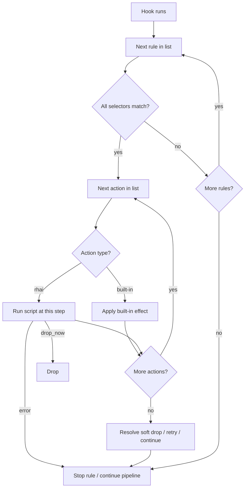

# Rules and actions

This page is the **behavioral home** for declarative policy in Conduit: how you declare rules under `rules:` in your [config file](/control-plane/config-file.md), what they can change on each query, and when they run on the [dataplane](/glossary/index.md#dataplane). For the query pipeline, see [Architecture and packet path](/concepts/architecture-and-packet-path.md). For **Rhai for rules** ([Rule Rhai](/glossary/index.md#rule-rhai)), see [Rhai](/rhai/index.md) ([Rule Rhai overview](/rhai/rule-rhai.md)). For planned [processor chains](/processor-chains/index.md) and **Rhai for processor chains** ([Processor-chain Rhai](/glossary/index.md#processor-chain-rhai)), see [Processor chains](/processor-chains/index.md). For planned [WASM](/glossary/index.md#wasm) and [sidecar](/glossary/index.md#sidecar) on rule hooks, see [Planned plugin models](/concepts/planned-plugin-models.md).

## Overview

A **rule** is a named piece of policy with:

- A **hook** — `request` or `response` (the [Request rules](/concepts/architecture-and-packet-path.md#request-rules) or [Response rules](/concepts/architecture-and-packet-path.md#response-rules) phase)
- **[Selectors](/glossary/index.md#selector)** — conditions on the [transaction](/glossary/index.md#transaction) (query name, type, response code, [tags](/glossary/index.md#tags), …)
- **[Actions](/glossary/index.md#action)** — built-in effects when every selector on that rule matches

Rules live under the top-level **`rules:`** key. In current releases, **`match_mode: first_match`** is the only supported mode: on each hook, Conduit walks the rule list from top to bottom and stops at the **first** rule whose selectors all match. Later rules on that hook are skipped for that query. Other **`match_mode`** values may be supported in a future release; until then, only **`first_match`** is accepted at config load.

When **no** rule matches on the request hook, Conduit continues to [Route](/concepts/architecture-and-packet-path.md#route) with the default [pool](/glossary/index.md#pool) path ([Pools and backends](/policy-routing/pools-and-backends.md)). When no rule matches on the response hook, Conduit continues to [Send](/concepts/architecture-and-packet-path.md#send) with the upstream answer or error already on the transaction.

## Request and response hooks

Every query walks the [pipeline phases](/concepts/architecture-and-packet-path.md#pipeline-phases) in order. **Rules** (built-in actions and optional [Rhai](/rhai/index.md) scripts) run only at **Request rules** and **Response rules** — the rule’s `hook:` must match that phase.

| Hook | Pipeline phase | When it runs | Runs again on retry? |
|------|----------------|--------------|----------------------|
| **Request** (`hook: request`) | [Request rules](/concepts/architecture-and-packet-path.md#request-rules) | After [Parse](/concepts/architecture-and-packet-path.md#parse), before [Route](/concepts/architecture-and-packet-path.md#route) | **No** — once per transaction |
| **Response** (`hook: response`) | [Response rules](/concepts/architecture-and-packet-path.md#response-rules) | After [Wait for response](/concepts/architecture-and-packet-path.md#wait-for-response) (answer or timeout), before [Send](/concepts/architecture-and-packet-path.md#send) or another [Route](/concepts/architecture-and-packet-path.md#route) | **Yes** — once per forward attempt |

### Pipeline placement

| Phase {: .column-no-wrap } | Rules run here? |
|-------|-----------------|
| [Receive](/concepts/architecture-and-packet-path.md#receive) | No |
| [Parse](/concepts/architecture-and-packet-path.md#parse) | No |
| [Request rules](/concepts/architecture-and-packet-path.md#request-rules) | **Yes — request hook** |
| [Route](/concepts/architecture-and-packet-path.md#route) | No |
| [Forward](/concepts/architecture-and-packet-path.md#forward) | No |
| [Wait for response](/concepts/architecture-and-packet-path.md#wait-for-response) | No |
| [Response rules](/concepts/architecture-and-packet-path.md#response-rules) | **Yes — response hook** |
| [Send](/concepts/architecture-and-packet-path.md#send) | No |

### Outcomes after each hook

Both hooks can **drop** the query (`drop` action or Rhai `txn.drop_query()` — no DNS reply). There is no separate **accept** action: when policy does not drop, Conduit continues the pipeline.

| Hook | Drop? | If not dropped, continue to… | Retry? |
|------|-------|------------------------------|--------|
| **Request rules** | Yes | [Route](/concepts/architecture-and-packet-path.md#route) → Forward → … | No |
| **Response rules** | Yes | [Send](/concepts/architecture-and-packet-path.md#send) | Yes → [Route](/concepts/architecture-and-packet-path.md#route) (Forward through Response rules again) |

On **retry**, the **request hook does not re-run**; [tags](/glossary/index.md#tags) and pool choice from the first request pass stay on the [transaction](/glossary/index.md#transaction) unless response policy changes them. Global limits and examples: [Retries and transactions](/policy-routing/retries-and-transactions.md).

For sequence diagrams and the full packet path, see [Architecture and packet path](/concepts/architecture-and-packet-path.md).

**Empty selectors** (`selectors: []`) match every query on that hook. Use with care on the response hook: a catch-all response rule runs after **every** forward attempt unless a more specific rule above it matches first.



Minimal example — route internal `A` queries to a pool and pin egress:

```yaml
rules:
  match_mode: first_match
  rules:
    - name: internal-a
      hook: request
      selectors:
        - type: qtype
          value: A
      actions:
        - type: set_pool
          value: internal
        - type: set_source_v4
          value: "10.0.0.5"
```

Every field on `rules:`, selectors, and actions: [Reference: rules](/reference/config-schema/rules.md).

## When changes to rules take effect { #when-changes-to-rules-take-effect }

When you reload or apply configuration (**SIGHUP**, `conduitctl reload`, or `conduitctl apply`), Conduit validates the file (including rules and script paths) and loads the result into the active [runtime snapshot](/glossary/index.md#runtime-snapshot) for **later** queries.

Queries already in progress keep the rules they started with — they do not switch mid-query to a half-applied config. If validation fails, Conduit keeps the previous working snapshot and DNS keeps flowing. See [Configuration model](/control-plane/configuration-model.md).

## Selectors { #selectors }

Every selector on a rule must match (**logical AND**). Supported types in current releases, grouped by purpose:

### Query identity

Conditions on the question being asked — use on the **request** hook.

| Type | Typical hook | Tests |
|------|--------------|--------|
| `qname_exact` | request | Exact query name |
| `qname_suffix` | request | Query name suffix |
| `qtype` | request | Query type (for example `A`, `AAAA`) |

### Response outcome

Conditions on the upstream result — use on the **response** hook after [Wait for response](/concepts/architecture-and-packet-path.md#wait-for-response) or timeout.

| Type | Typical hook | Tests |
|------|--------------|--------|
| `rcode` | response | Response code (for example `SERVFAIL`, `NXDOMAIN`) |

### Transaction metadata

[Tags](/glossary/index.md#tags) set earlier on the same [transaction](/glossary/index.md#transaction) (for example by a prior rule or Rhai for rules).

| Type | Typical hook | Tests |
|------|--------------|--------|
| `tag` | both | Tag presence or value |

### Sampling and cadence { #sampling-and-cadence }

Limit **which queries** the rule applies to. Decisions are **deterministic** per transaction (same transaction always gets the same pass/fail for a given selector).

| Type {: .column-no-wrap } | Typical hook | Tests |
|------|--------------|--------|
| `every_nth_global` | both | Process-wide query index `% N == 0` (`N >= 1`) |
| `every_nth_worker` | both | Worker-local transaction id `% N == 0` (`N >= 1`) |
| `sample_percent` | both | ~`value`% of transactions (`0..100`); optional `key` / `key_from` — see below |

`sample_percent` accepts optional **salt** fields (mutually exclusive):

| Field | Where | Meaning |
|-------|--------|---------|
| *(omit both)* | everywhere | Global bucket from transaction id only (legacy behavior) |
| `key: "…"` | rule selectors; tracing/event top-level `sample_key` | Static salt — independent ~N% slice for this policy |
| `key_from: qname` | rule selectors; tracing `sample_key_from`; event selectors | Per-query-name salt (canonical wire qname) |
| `key_from: rule_name` | **rule selectors only** | Salt is the rule’s `name` (resolved at compile time) |
| `key_from: sink_name` | **event sink filters only** (selectors or top-level) | Salt is the sink’s canonical `name` |

Use **`key`** for a shared slice across a zone (for example `key: "internal.example"` with `qname_suffix`). Use **`key_from: qname`** when each qname should get its own ~N% slice. Different keys at the same percentage are **independent** — a transaction can pass one rule’s sample and fail another’s.

Rhai: `txn.sample_percent(percent)` uses the global bucket; `txn.sample_percent(percent, key)` uses static **`key:`**; `txn.sample_percent_for_qname(percent)` and `txn.sample_percent_for_rule(percent)` match **`key_from: qname`** and **`key_from: rule_name`**; `txn.every_nth_worker(n)` and `txn.every_nth_global(n)` match the cadence selectors. See [Transaction API — Sampling](/rhai/transaction-api.md#sampling).

`every_nth_worker` uses the per-worker transaction counter that starts at **1**, so `N=4` matches ids **4, 8, 12, …** on each worker thread.

`every_nth_global` uses a process-wide query index incremented **once** when each query transaction is created, before selector evaluation.

#### Examples

**`sample_percent` only** — tag roughly 10% of all queries on the request hook (deterministic per transaction id):

```yaml
    - name: sample-audit-tag
      hook: request
      selectors:
        - type: sample_percent
          value: "10"
      actions:
        - type: set_tag
          value: audit=1
```

**AND with query identity** — only queries under this suffix *and* in the sample pass (~25% of suffix matches when using a zone `key`):

```yaml
    - name: sample-internal-zone
      hook: request
      selectors:
        - type: qname_suffix
          value: ".internal.example."
        - type: sample_percent
          value: "25"
          key: "internal.example"
      actions:
        - type: set_tag
          value: sampled_internal=1
```

**Per-rule salt** — `key_from: rule_name` binds the sample to this rule’s `name` (independent from other rules at the same percentage):

```yaml
    - name: audit-canary
      hook: request
      selectors:
        - type: sample_percent
          value: "10"
          key_from: rule_name
      actions:
        - type: set_tag
          value: audit_canary=1
```

**Every Nth on worker vs process-wide** — same `N`, different scope (only the selector type changes):

```yaml
    - name: canary-every-fourth-worker
      hook: request
      selectors:
        - type: every_nth_worker
          value: "4"
      actions:
        - type: set_pool
          value: canary

    - name: canary-every-fourth-global
      hook: request
      selectors:
        - type: every_nth_global
          value: "4"
      actions:
        - type: set_pool
          value: canary
```

For **`sample_percent` on tracing or event export** (no rule required), see [Tracing](/observability/tracing.md) and [Event export](/observability/event-export.md).

## Action order on one rule { #action-order-on-one-rule }

When every selector on a rule matches, Conduit runs that rule’s **`actions:`** list. **Every action runs in list order** (top to bottom) — built-in actions and **`type: rhai`** steps are interleaved exactly as written.

Order matters when multiple actions touch the same [transaction](/glossary/index.md#transaction) fields. Put safety-critical or cheap built-in effects **above** a **`rhai`** step when they must run before script logic or when the script might fail ([sandbox limits](/rhai/sandbox-limits.md) — further actions on that rule are skipped after a script error).

When you use **`set_pool`** and **`set_source_v4`** / **`set_source_v6`** on the **same** rule, list **`set_pool` first**, then the source action — so [Forward](/concepts/architecture-and-packet-path.md#forward) checks the override against the allowed addresses for the pool you just selected.

### Outcome at end of rule { #outcome-at-end-of-rule }

Soft **`drop`** and soft **`retry`** are resolved **after** all actions on the rule have run. Conduit then applies **one** of these results:

1. **Drop** — if soft drop is set at the end of the rule, or the rule already stopped with **`drop_now`**
2. **Retry** — otherwise, if soft retry is set (response hook only)
3. **Continue** — otherwise, proceed to the next pipeline phase

If both soft drop and soft retry are set, **drop takes precedence** over retry.

**`retry_now`** and Rhai **`txn.request_retry_now()`** do **not** clear soft drop. If an earlier action on the same rule set soft drop (`drop` or `txn.drop_query()`), **`retry_now` still results in drop**, not retry. Call **`clear_drop`** first only when you mean to cancel that soft drop on this rule — Conduit does not do that implicitly.

### Drop actions

| Action {: .column-no-wrap } | Effect |
|--------|--------|
| `clear_drop` | Clears soft-drop intent from an earlier `drop` or Rhai `txn.drop_query()` on this rule |
| `drop` | **Soft** drop — later actions on this rule still run; if drop is still set at the end of the rule, the query stops at this hook with **no** DNS reply |
| `drop_now` | **Hard** drop — stop immediately; no further actions on this rule run |

[Rhai](/rhai/index.md) equivalents: `txn.drop_query()` (soft), `txn.drop_query_now()` (hard), `txn.clear_drop()`. See [Outcome at end of rule](#outcome-at-end-of-rule).

### Retry actions { #retry-actions }

| Action {: .column-no-wrap } | Effect |
|--------|--------|
| `clear_retry` | Clears soft-retry intent from an earlier `retry` or Rhai `txn.request_retry()` on this rule (response hook only) |
| `clear_retry_pool` | Clears `retry_pool` on the [transaction](/glossary/index.md#transaction) |
| `retry` | **Soft** retry (response hook only) — later actions on this rule still run; if retry is still requested at the end of the rule, re-enter [Route](/concepts/architecture-and-packet-path.md#route) |
| `retry_now` | **Hard** retry (response hook only) — stop immediately and re-enter [Route](/concepts/architecture-and-packet-path.md#route); blocked by soft drop unless **`clear_drop`** ran earlier on this rule |
| `set_retry_pool` | Pool used on retry [Route](/concepts/architecture-and-packet-path.md#route) if retry occurs — first [Route](/concepts/architecture-and-packet-path.md#route) ignores it |
| `set_retry_source_v4` | One-shot IPv4 egress for next retry forward if retry occurs; first forward ignores |
| `set_retry_source_v6` | One-shot IPv6 egress for next retry forward if retry occurs; first forward ignores |
| `clear_retry_source_v4` | Clears `retry_source_override_v4` |
| `clear_retry_source_v6` | Clears `retry_source_override_v6` |

[Rhai](/rhai/index.md) equivalents: `txn.set_retry_pool(name)` (same as **`set_retry_pool`** above), `txn.set_retry_source_v4(addr)` / `txn.set_retry_source_v6(addr)`, `txn.clear_retry_source_v4()` / `txn.clear_retry_source_v6()`, `txn.request_retry()` (soft), `txn.request_retry_now()` (hard), `txn.clear_retry()` (soft retry only), `txn.clear_retry_pool()`. See [Outcome at end of rule](#outcome-at-end-of-rule). To fail over to another pool on the response hook, use **`set_retry_pool`** then **`retry`** or **`retry_now`**. To change egress bind on retry only, use **`set_retry_source_*`** then **`retry`** or **`retry_now`**.

The selected [pool](/glossary/index.md#pool) can also come from an **earlier** matching rule or from the default pool when no rule sets one. At [Forward](/concepts/architecture-and-packet-path.md#forward), Conduit still requires the override to be in the **allowed set for that pool** (global `forward.sources_*` ∪ that pool’s `sources_*`). If the override is not allowed, Conduit **falls back to round-robin** among configured sources — same behavior as [Rhai](/rhai/index.md) `set_source_v4` / `set_source_v6`. See [Dual-stack forwarding](/guides/dual-stack-forwarding.md#choosing-an-egress-source).

## Request-hook actions

Use on `hook: request` — after [Parse](/concepts/architecture-and-packet-path.md#parse), before [Route](/concepts/architecture-and-packet-path.md#route).

| Action {: .column-no-wrap } | `value` | Effect |
|--------|---------|--------|
| `clear_drop` | — | Clear soft-drop intent on this rule |
| `clear_tag` | Tag key (non-empty) | Removes a [tag](/glossary/index.md#tags) key from the [transaction](/glossary/index.md#transaction) |
| `clear_retry_pool` | — | Clears `retry_pool` — see [Retry actions](#retry-actions) |
| `drop` | — | Soft drop — see [Drop actions](#action-order-on-one-rule) |
| `drop_now` | — | Hard drop — stop further actions on this rule |
| `rhai` | Script path | Runs the linked [Rhai](/rhai/index.md) script at this position in the list |
| `set_pool` | Pool name | Sets the target [pool](/glossary/index.md#pool) for the first [Route](/concepts/architecture-and-packet-path.md#route) |
| `set_retry_pool` | Pool name | Pool for retry Route if retry occurs; first Route ignores — see [Retry actions](#retry-actions) |
| `set_source_v4` | IPv4 address | Pins upstream egress to this local IPv4 address for this query (every forward unless retry source wins) |
| `set_source_v6` | IPv6 address | Pins upstream egress to this local IPv6 address for this query (every forward unless retry source wins) |
| `set_retry_source_v4` | IPv4 address | One-shot IPv4 egress for next retry forward if retry occurs; first forward ignores |
| `set_retry_source_v6` | IPv6 address | One-shot IPv6 egress for next retry forward if retry occurs; first forward ignores |
| `clear_retry_source_v4` | — | Clears `retry_source_override_v4` |
| `clear_retry_source_v6` | — | Clears `retry_source_override_v6` |
| `set_tag` | `key=value` or `key` (→ `true`) | Sets a [tag](/glossary/index.md#tags) on the [transaction](/glossary/index.md#transaction) |

**`set_source_v4` / `set_source_v6`** — request hook only. The address must appear in **`forward.sources_v4`** / **`forward.sources_v6`** or a pool’s **`sources_v4`** / **`sources_v6`** (union checked when config is validated).

**`set_retry_source_v4` / `set_retry_source_v6`** — request **or** response hook. Stashes a one-shot egress override for the next retry forward; does **not** trigger retry. Address validation matches **`set_source_*`** (global union at validate/reload). See [Source selection lifecycle](/policy-routing/retries-and-transactions.md#source-selection-lifecycle).

**`clear_retry_source_v4` / `clear_retry_source_v6`** — request or response hook; clears the retry-source stash only (not standing **`set_source_*`** overrides).

**`set_retry_pool`** / **`clear_retry_pool`** — writes or clears the shared `retry_pool` field on the [transaction](/glossary/index.md#transaction). `retry_pool` is one-shot at Route; see [Retries and transactions — Pool selection lifecycle](/policy-routing/retries-and-transactions.md#pool-selection-lifecycle).

## Response-hook actions

Use on `hook: response` — after an upstream answer or forward timeout, before [Send](/concepts/architecture-and-packet-path.md#send) or a [retry](/glossary/index.md#retry).

| Action {: .column-no-wrap } | `value` | Effect |
|--------|---------|--------|
| `clear_drop` | — | Clear soft-drop intent on this rule |
| `clear_tag` | Tag key (non-empty) | Removes a [tag](/glossary/index.md#tags) key from the [transaction](/glossary/index.md#transaction) |
| `clear_retry` | — | Clear soft-retry intent on this rule — see [Retry actions](#retry-actions) |
| `clear_retry_pool` | — | Clears `retry_pool` — see [Retry actions](#retry-actions) |
| `drop` | — | Soft drop — see [Drop actions](#action-order-on-one-rule) |
| `drop_now` | — | Hard drop — stop further actions on this rule |
| `retry` | — | Soft retry in the current [pool](/glossary/index.md#pool) — see [Retry actions](#retry-actions) |
| `retry_now` | — | Hard retry — see [Retry actions](#retry-actions); blocked by soft drop unless **`clear_drop`** ran earlier on this rule |
| `rhai` | Script path | Runs the linked [Rhai](/rhai/index.md) script at this position in the list |
| `set_rcode` | RCODE name | Sets response code metadata (for example before [Send](/concepts/architecture-and-packet-path.md#send)) |
| `set_retry_pool` | Pool name | Pool for retry Route if retry occurs; first Route ignores — see [Retry actions](#retry-actions) |
| `set_retry_source_v4` | IPv4 address | One-shot IPv4 egress for next retry forward if retry occurs; first forward ignores |
| `set_retry_source_v6` | IPv6 address | One-shot IPv6 egress for next retry forward if retry occurs; first forward ignores |
| `clear_retry_source_v4` | — | Clears `retry_source_override_v4` |
| `clear_retry_source_v6` | — | Clears `retry_source_override_v6` |
| `set_tag` | `key=value` or `key` (→ `true`) | Sets a [tag](/glossary/index.md#tags) on the [transaction](/glossary/index.md#transaction) |

**`retry`**, **`retry_now`**, **`clear_retry`**, **`clear_retry_pool`**, and **`set_retry_pool`** — see [Retry actions](#retry-actions) and [Retries and transactions](/policy-routing/retries-and-transactions.md). Use **`retry`** to stay in the current [pool](/glossary/index.md#pool); pair **`set_retry_pool`** with **`retry`** or **`retry_now`** to target a different pool on the next attempt. Use **`clear_retry_pool`** when a pool set for retry Route should not apply (for example same-pool **`retry`** after request policy set **`set_retry_pool`** for another pool).

**`set_source_v4` / `set_source_v6`** are not supported on the response hook (standing egress is request-only; use **`set_retry_source_*`** on the response hook for outcome-driven retry egress). See [Transaction API — Egress](/rhai/transaction-api.md#egress).

## Scripted policy (Rhai for rules) { #scripted-policy-rule-rhai }

When built-in actions are not enough, add **`type: rhai`** anywhere in a matching rule’s `actions:` list. Conduit runs each **`rhai`** step **at that position** in the list — not after all built-ins.

Conduit still uses **`match_mode: first_match`** on each hook: only the **first** matching rule runs. List order example — built-in pool, then script refinement:

```yaml
    - name: geo-route
      hook: request
      selectors:
        - type: qname_suffix
          value: ".example."
      actions:
        - type: set_pool
          value: default
        - type: rhai
          value: scripts/geo-pool.rhai
        - type: set_tag
          value: geo_routed=true
```

The script can override earlier YAML effects (for example `txn.set_pool("vip")` after `set_pool: default`). One `.rhai` file can be referenced from multiple rules; Conduit compiles it once per `(rule_name, path)` and runs it only when that rule wins first-match on the matching hook.

Request- and response-hook script examples:

```yaml
    - name: block-on-list
      hook: request
      selectors:
        - type: qname_suffix
          value: ".blocked."
      actions:
        - type: rhai
          value: scripts/blocklist.rhai
    - name: servfail-failover
      hook: response
      selectors:
        - type: rcode
          value: SERVFAIL
      actions:
        - type: rhai
          value: scripts/servfail-retry.rhai
```

The script receives a sandboxed **`txn`** object — policy fields only ([pool](/glossary/index.md#pool), [tags](/glossary/index.md#tags), egress, drop, retry). It does **not** edit DNS wire bytes. Phase-specific behavior, guards, and pairing request/response scripts: [Hooks and phases](/rhai/hooks-and-phases.md). Method reference: [Transaction API](/rhai/transaction-api.md).

When [processor chains](/processor-chains/index.md) ship, they are planned to refine policy **after** rules on the same [transaction](/glossary/index.md#transaction) — alongside wire editing. See [Policy refinement (planned)](/processor-chains/index.md#policy-refinement-planned).

Overview and when to use scripts: [Rhai for rules](/rhai/rule-rhai.md) ([Rhai](/rhai/index.md)).

## Validation errors (common)

These messages appear when config is loaded or validated (reload, apply, or startup):

| Message (typical) | Cause |
|-------------------|--------|
| `retry … only valid on response hook` | `retry`, `retry_now`, or `clear_retry` on `hook: request` |
| `set_retry_pool requires a pool name in value` | Empty `value` on `set_retry_pool` |
| `set_source_v4 … only valid on request hook` | Standing source action on `hook: response` |
| `set_source_v4 … not in configured sources_v4` | Address not in global or pool `sources_v4` union |
| `set_source_v4 requires forward.sources_v4 or pool sources_v4` | No v4 sources configured anywhere |
| `set_retry_source_v4 … not in configured sources_v4` | Retry-source address not in global or pool `sources_v4` union |
| `set_retry_source_v4 requires forward.sources_v4 or pool sources_v4` | Retry-source action but no v4 sources configured |
| `unknown action type` | Typo in `type:` |
| `rule name must not be empty` | Missing or blank `name` on a rule |
| `duplicate rule name '…'` | Two rules share the same `name` |

Full validation rules: [Reference: rules](/reference/config-schema/rules.md).

## Related topics

- [Architecture and packet path](/concepts/architecture-and-packet-path.md) — [Request rules](/concepts/architecture-and-packet-path.md#request-rules) and [Response rules](/concepts/architecture-and-packet-path.md#response-rules) in the pipeline
- [Pools and backends](/policy-routing/pools-and-backends.md) — `set_pool`, default pool, backend weights
- [Retries and transactions](/policy-routing/retries-and-transactions.md) — [Pool selection lifecycle](/policy-routing/retries-and-transactions.md#pool-selection-lifecycle), `set_retry_pool`, `retry`, attempt limits; full request/response rule examples
- [Event export](/observability/event-export.md) — request `set_tag` plus sink filters
- [Tracing](/observability/tracing.md) — `activation.sample_percent` and selectors without a matching rule
- [Dual-stack forwarding](/guides/dual-stack-forwarding.md) — `set_source_v4` / `set_source_v6`
- [Rhai](/rhai/index.md) — Rhai for rules and Rhai for processor chains; [Rule Rhai overview](/rhai/rule-rhai.md); [Hooks and phases](/rhai/hooks-and-phases.md) for script-specific phase behavior
- [Planned plugin models](/concepts/planned-plugin-models.md) — [WASM](/glossary/index.md#wasm), [sidecar](/glossary/index.md#sidecar) (not yet shipped)
