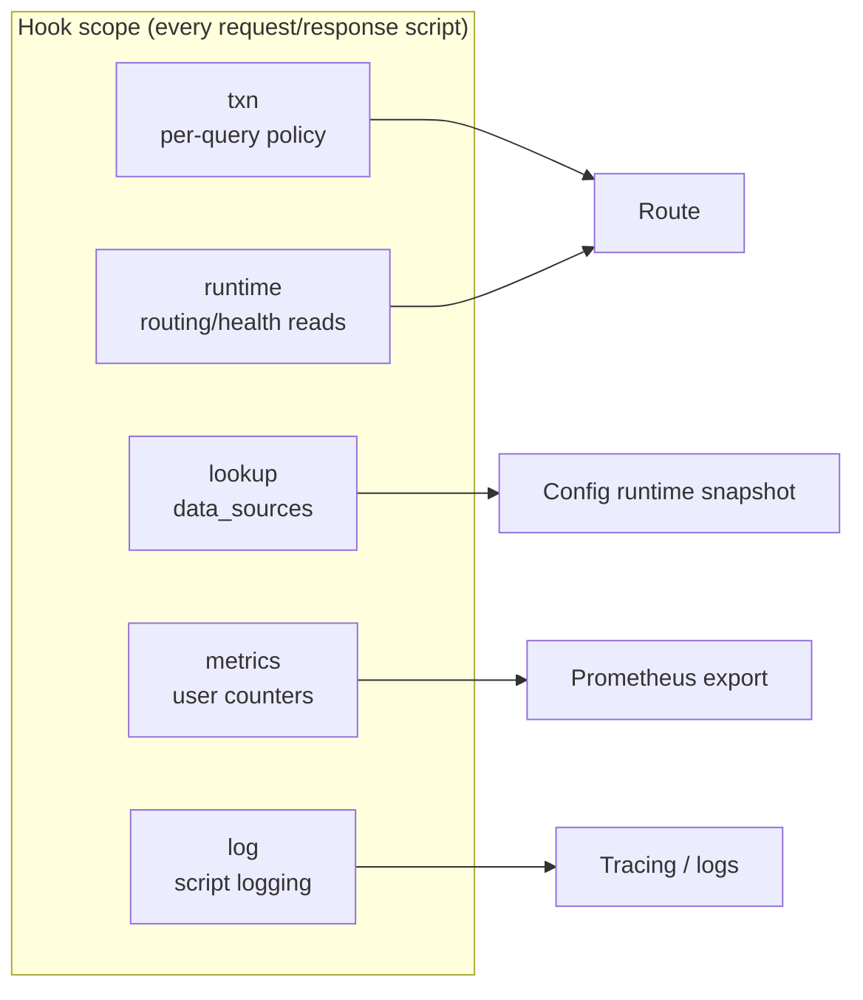

# Host API overview

Every [Rule Rhai](/glossary/index.md#rule-rhai) hook invocation receives a **fixed set of host scope objects**. Each object belongs to one **mutability class** — per-query policy, read-only process state, read-only tables, or write-only observability side effects.

This page is the **architecture map**. Method-level reference is described on the linked pages below.

## How to read method reference pages { #how-to-read-method-reference-pages }

[Transaction API (`txn`)](/rhai/txn-api.md), [Runtime API](/rhai/runtime-api.md), and [Script logging](/rhai/script-logging.md) use the same **method card** layout:

| Part | Meaning |
|------|---------|
| **Brief** | Hooks, signature, return, and a one-line summary — visible when the reference block is collapsed |
| **Reference** | Chevron opens **Hooks**, **Arguments / return**, **Summary**, **Behavior**, YAML/config, and **Example** |

Methods are grouped under purpose headings (`## Routing`, `## Tags`, …). Each group lists its methods in an index line, then one card per method. Long pages set `toc_collapsible: true` on the right-hand TOC; use **Expand all** / **Collapse all** above a group when present.

**Request hook** runs once per transaction before [Route](/concepts/architecture-and-packet-path.md#route). **Response hook** runs after each forward attempt. Which methods are allowed on which hook: [Hooks and phases — Phase guards](/rhai/hooks-and-phases.md#phase-guards). YAML `hook:` wiring: [Rules and actions — Request and response hooks](/policy-routing/rules-and-actions.md#request-and-response-hooks).

**`runtime.routing()`** and other view types use Rhai **method calls** (`runtime.routing().pool("name")`), not property access.

## Five scope objects

| Scope | Rhai binding | Mutability | What it represents |
|-------|--------------|------------|-------------------|
| **`txn`** | `txn` | **Read/write** (this query) | Per-query policy: pools, tags, drop/retry, egress overrides, question/response reads |
| **`runtime`** | `runtime` | **Read-only** (process) | Routing and health snapshot at **hook phase start** via **`runtime.routing()`** |
| **`lookup`** | `lookup` (object) + global **`lookup()`** | **Read-only** (snapshot) | CSV tables from **`data_sources:`** |
| **`metrics`** | `metrics` | **Write** (counters) | Declared user metrics → `conduit_user_*` |
| **`log`** | `log` | **Write** (emit) | Structured script log lines via Conduit tracing |

**Design rule:** if an operation changes **this query’s** outcome, it belongs on **`txn`**. If it reads **shared** routing/health state, use **`runtime`**. If it reads a **configured table**, use **`lookup`**. If it increments a **named counter**, use **`metrics`**. If it emits a **log line**, use **`log`**.

## What each reference covers

| Topic | Page |
|-------|------|
| **`txn`** methods (pools, tags, drop/retry, egress, question/response, sampling) | [Transaction API (`txn`)](/rhai/txn-api.md) |
| **`runtime.routing()`** pool/backend views | [Runtime API](/rhai/runtime-api.md) |
| **`lookup()`** and **`data_sources:`** | [Data sources and lookups](/rhai/data-sources-and-lookups.md) |
| **`metrics.inc`** / **`metrics.inc_labels`** | [User metrics](/rhai/user-metrics.md) |
| **`log.info`** / **`log.warn`** | [Script logging](/rhai/script-logging.md) |
| Hook timing and phase guards | [Hooks and phases](/rhai/hooks-and-phases.md) |

## When values are taken { #when-values-are-taken }

Each host surface captures data at a different moment. This matters when you mix **`txn`**, **`runtime`**, and **`lookup`** in one script.

| Surface | When values are fixed |
|---------|------------------------|
| **`txn`** | You can change per-query policy during the script; effects apply when the script finishes successfully |
| **`runtime.routing()`** | One snapshot when **this hook phase begins** (request or response rules) on this worker — health and routing fields fixed for the whole script; each method call reuses the same snapshot |
| **`lookup()`** | Configuration [runtime snapshot](/glossary/index.md#runtime-snapshot) generation from when the [transaction](/glossary/index.md#transaction) started |
| **`metrics`** | Counter increments apply after a successful script run (export follows your metrics profile) |
| **`log`** | Each call writes immediately (rate-limited) |

Detail on **`runtime.routing()`** timing: [Runtime API — When values are taken](/rhai/runtime-api.md#when-values-are-taken).

## Mental model for script authors

**Request hook** — typical order of thought:

1. Read **`txn.question()`** / **`lookup()`** for client intent and static tables.
2. Read **`runtime.routing().pool(...)`** when health-aware pool choice matters (failover, [drain](/glossary/index.md#drain) awareness).
3. **`txn.set_pool`**, **`txn.set_tag`**, **`txn.drop_query`**, etc. to set policy.
4. **`metrics.inc`** for counters; **`log.warn`** for canary/debug branches.

**Response hook** — add upstream outcome:

1. **`txn.response()`** / **`txn.response_rcode()`** for the current attempt.
2. **`runtime.routing().backend_for_attempt(txn.selected_pool(), txn.selected_backend_name())`** for per-attempt health.
3. **`txn.request_retry()`**, **`txn.set_retry_pool`**, or **`txn.set_rcode`** as needed.

## Related

- [Rhai overview](/rhai/index.md)
- [Rule Rhai](/rhai/rule-rhai.md) — attaching scripts to rules
- [Rhai policy guide](/guides/rhai-policy.md) — hands-on labs
- [Sandbox limits](/rhai/sandbox-limits.md) — `max_operations`, timeouts
