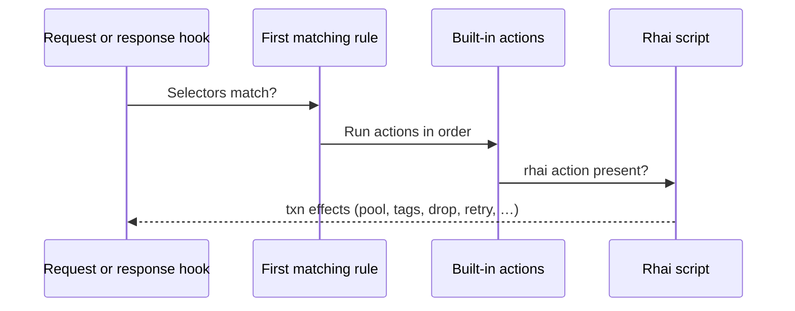

# Rhai

[Rule Rhai](/glossary/index.md#rule-rhai) is Conduit’s **scripted policy** on matching [rules](/policy-routing/rules-and-actions.md) — for logic you cannot express with built-in actions alone. You keep `.rhai` files beside your config, reference them from rules via `type: rhai`, and Conduit runs them at [Request rules](/concepts/architecture-and-packet-path.md#request-rules) and [Response rules](/concepts/architecture-and-packet-path.md#response-rules) on the [dataplane](/glossary/index.md#dataplane).

This section documents **Rule Rhai** (`txn` policy API). It is not [Processor-chain Rhai](/glossary/index.md#processor-chain-rhai) — planned DNS wire editing under `processors:` (separate config and API, **not yet shipped**). For how rules and scripts fit together, see [Policy & routing](/policy-routing/index.md) and [Rules and actions](/policy-routing/rules-and-actions.md).

## When to use Rule Rhai

Built-in [selectors](/glossary/index.md#selector) and [actions](/glossary/index.md#action) cover most routing — pool choice, [tags](/glossary/index.md#tags), egress overrides, **drop**, and [retry](/glossary/index.md#retry). Reach for Rule Rhai when you need logic on top of that, for example:

- Branch on a [lookup table](/rhai/data-sources-and-lookups.md) (`table_lookup`) on the **request** hook — for example map qname to a pool before [Route](/concepts/architecture-and-packet-path.md#route), instead of a long static rule list
- Combine several checks in one script — for example upstream [rcode](/glossary/index.md#rcode) **and** a [tag](/glossary/index.md#tags) set on the request hook → `retry_pool("backup")` on the **response** hook
- Set [tags](/glossary/index.md#tags) that drive [event export](/observability/event-export.md) filters or [tracing](/observability/tracing.md) activation
- Apply deterministic per-transaction sampling in scripts with `txn.sample_percent(percent)` (`0..100`)
- Publish custom counters (`conduit_user_*`) from policy — [User metrics](/rhai/user-metrics.md)

If declarative YAML is enough, prefer [Rules and actions](/policy-routing/rules-and-actions.md). Rule Rhai adds flexibility and operational surface (script files, [sandbox limits](/rhai/sandbox-limits.md), compile-time checks on reload), but runs an interpreted script on the query path for each matching rule — **higher per-query cost** than built-in actions alone. Prefer built-in selectors and actions when they express the same policy.

## How scripts attach to rules

Rhai does **not** run on every query by default. A script runs only when a **matching** rule on that hook includes a **`rhai`** [action](/glossary/index.md#action) whose `value` is the script path.

On each hook, Conduit still uses **`match_mode: first_match`**: it walks rules top to bottom and stops at the first rule whose selectors all match. For that rule:

1. Built-in **actions** run in list order.
2. If the rule includes **`type: rhai`**, Conduit runs the linked script **after** those actions.

The script receives a sandboxed **`txn`** object for the current [transaction](/glossary/index.md#transaction). It can refine what built-in actions already set — for example override [pool](/glossary/index.md#pool) choice or add [tags](/glossary/index.md#tags) — or **drop** / request **retry** on its own.



Hook timing, first-match rules, and YAML wiring: [Rules and actions](/policy-routing/rules-and-actions.md). Phase guards and pairing request/response scripts: [Hooks and phases](/rhai/hooks-and-phases.md). Method-level detail: [Transaction API](/rhai/transaction-api.md).

## Minimal example

**Config** — route names ending in `.vip.example.` through a script (paths resolve relative to the config file directory; see [Config file — path resolution](/control-plane/config-file.md#path-resolution-base-directory)):

```yaml
schema_version: 1
listeners:
  listeners:
    - address: "127.0.0.1:15353"
      protocol: udp
pools:
  - name: default
    backends:
      - address: "127.0.0.1:5300"
  - name: vip
    backends:
      - address: "127.0.0.1:5301"
rhai:
  max_operations: 10000
  max_call_depth: 32
  hook_timeout_ms: 50
rules:
  match_mode: first_match
  rules:
    - name: vip-routing
      hook: request
      selectors:
        - type: qname_suffix
          value: ".vip.example."
      actions:
        - type: rhai
          value: scripts/set-vip-pool.rhai
```

**Script** (`scripts/set-vip-pool.rhai`):

```rhai
txn.set_tag("tier", "vip");
txn.set_pool("vip");
```

After **SIGHUP**, `conduitctl reload`, or `conduitctl apply`, Conduit compiles the script into the active [runtime snapshot](/glossary/index.md#runtime-snapshot). Queries that match the rule run the script on the request hook before [Route](/concepts/architecture-and-packet-path.md#route).

## Configuration

| Concern | Where | Topic page |
|---------|-------|------------|
| Sandbox limits (operations, call depth, hook timeout) | `rhai:` | [Sandbox limits](/rhai/sandbox-limits.md) |
| Script path on a rule | `rules:` → `type: rhai` | [Rules and actions](/policy-routing/rules-and-actions.md), [Reference: rules](/reference/config-schema/rules.md) |
| Lookup tables for scripts | `data_sources:` | [Data sources and lookups](/rhai/data-sources-and-lookups.md) |
| Custom metric names and labels | Declared in script source at compile time | [User metrics](/rhai/user-metrics.md) |

When you omit the top-level **`rhai:`** block, Conduit still applies default sandbox limits (**10000** operations, call depth **32**, **50** ms hook timeout). You only need **`rhai:`** in the file when you want to tune those limits.

Omitting **`rules:`** entirely means no scripts run — Rhai is opt-in per rule.

## When script changes take effect

Conduit **reads and compiles** `.rhai` files when it builds a [runtime snapshot](/glossary/index.md#runtime-snapshot) — at process start and on each successful reload or apply. Editing a script on disk has **no** effect on live queries until that snapshot swap succeeds.

- **`conduitctl validate`** runs the same YAML checks and snapshot compile as startup/reload — use it to catch missing script paths or Rhai syntax errors before deploy.
- [Transactions](/glossary/index.md#transaction) already in flight keep the scripts they started with.
- If reload validation fails (bad script syntax, missing file, invalid metric registration), Conduit keeps the previous working snapshot and DNS keeps flowing. See [Configuration model](/control-plane/configuration-model.md).

## Script errors and limits

Each hook invocation runs under [sandbox limits](/rhai/sandbox-limits.md) (`max_operations`, `max_call_depth`, `hook_timeout_ms`). If a script traps, exceeds a limit, or calls an API not allowed on that hook (for example `response()` on the request hook), Conduit logs a warning and **continues without applying further script effects for that hook** — the query is not dropped solely because the script failed.

Built-in actions on the same rule still ran before the script. Use [Logging](/observability/logging.md) at **`warn`** or higher to see `rhai script error` lines; built-in forward health and query counters still reflect the rest of the pipeline.

## Read in order

1. [Hooks and phases](/rhai/hooks-and-phases.md) — request vs response from a script author’s view, phase guards, pairing scripts
2. [Transaction API](/rhai/transaction-api.md) — `txn` methods, phase guards, YAML equivalents
3. [Sandbox limits](/rhai/sandbox-limits.md) — `rhai:` fields, defaults, tuning and failure behavior
4. [Data sources and lookups](/rhai/data-sources-and-lookups.md) — `data_sources:` and `table_lookup`
5. [User metrics](/rhai/user-metrics.md) — `metric_inc`, `conduit_user_*` export

## Prerequisites

- [Architecture and packet path](/concepts/architecture-and-packet-path.md) — [pipeline phases](/concepts/architecture-and-packet-path.md#pipeline-phases) and where [Request rules](/concepts/architecture-and-packet-path.md#request-rules) / [Response rules](/concepts/architecture-and-packet-path.md#response-rules) run
- [Rules and actions](/policy-routing/rules-and-actions.md) — selectors, built-in actions, and `rhai` action wiring
- [Config file](/control-plane/config-file.md) — path resolution for script and CSV paths

## Related

- [Policy & routing](/policy-routing/index.md) — pools, retries, and declarative policy
- [Dual-stack forwarding](/guides/dual-stack-forwarding.md) — `set_source_v4` / `set_source_v6` in rules and Rhai
- [Event export](/observability/event-export.md) — tag-based sink filters
- [Built-in metrics](/observability/built-in-metrics.md) — dataplane counters alongside user metrics
- [Planned plugin models](/concepts/planned-plugin-models.md) — WASM, sidecar, processor chains (**not yet shipped**)
