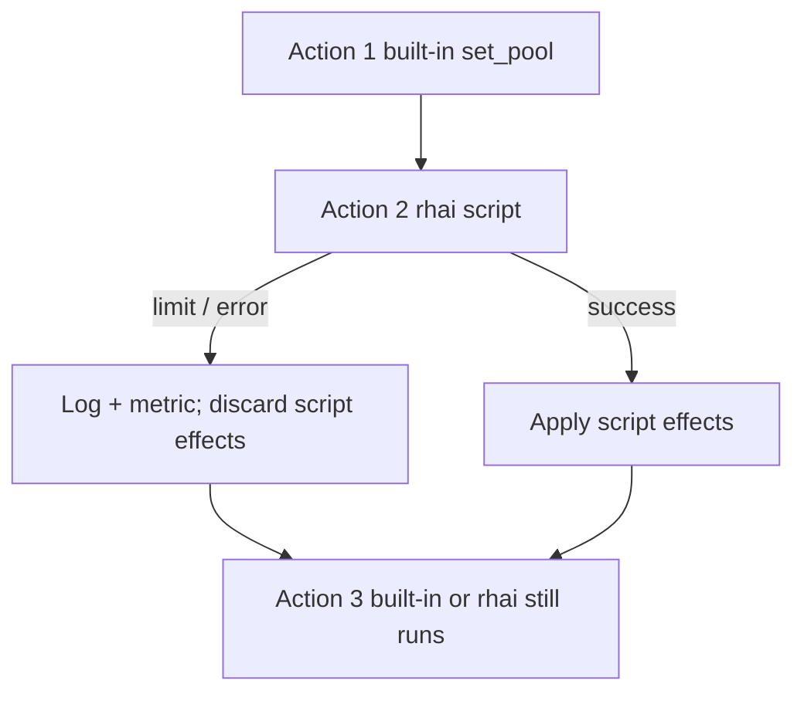

# Sandbox limits

**Rhai for rules** ([Rule Rhai](/rhai/rule-rhai.md)) runs on the DNS query path inside a bounded sandbox. This page describes the global **`rhai:`** limits in your [config file](/control-plane/config-file.md), what happens when a script hits a guard or fault, and patterns that keep policy safe under load.

For hook timing and phase-specific APIs, see [Hooks and phases](/rhai/hooks-and-phases.md). For compile-time script checks, see [Reload and validation](#reload-and-validation) below.

## Overview

Each **`rhai`** step on a matching rule runs the linked `.rhai` file once per hook invocation. Conduit applies three global caps from the **`rhai:`** block:

| Limit | What it bounds |
|-------|----------------|
| **`max_operations`** | Rhai instruction steps per script run (CPU work) |
| **`max_call_depth`** | Maximum function call nesting |
| **`hook_timeout_ms`** | Wall-clock time per script run on a hook |

Limits apply to **Rule Rhai only** today. They are stored in the [runtime snapshot](/glossary/index.md#runtime-snapshot) and take effect on the next successful reload or apply — no process restart required.

When a script hits a limit, throws, or calls an API on the wrong hook, Conduit records [`conduit_script_errors_total`](/observability/built-in-metrics.md#conduit_script_errors_total), logs **`rhai script error`** at **warn**, and **does not drop the query** solely because the script failed ([fail-open](#fail-open-behavior)).

## Config: `rhai:` block

Field reference: [Config schema: rhai](/reference/config-schema/rhai.md).

| Field {: .column-no-wrap } | Type | Required | Default | Description |
|-------|------|----------|---------|-------------|
| `max_operations` | integer | no | **10000** | Rhai operations budget per script invocation. Must be **≥ 1** if set explicitly in YAML ( **`0` fails validation** ). |
| `max_call_depth` | integer | no | **32** | Maximum call-stack depth for Rhai functions. Must be **≥ 1** if set explicitly. |
| `hook_timeout_ms` | integer | no | **50** | Wall-clock limit in milliseconds for one script run. **`0` in YAML means use default 50** — not unlimited. |

When the entire **`rhai:`** block is **omitted**, Conduit still applies the same defaults at load time (see [Minimal configuration](/getting-started/minimal-configuration.md)).

### Example

```yaml
rhai:
  max_operations: 10000
  max_call_depth: 32
  hook_timeout_ms: 50
```

Lab fixture with a tight operations cap (infinite-loop test config):

```yaml
rhai:
  max_operations: 100
  max_call_depth: 8
  hook_timeout_ms: 50
```

Repository reference: `tests/fixtures/config/with-rhai-infinite-loop.yaml`.

### Validation

| Rule | Error if violated |
|------|-------------------|
| `max_operations` ≥ **1** when present | `rhai.max_operations must be >= 1 when set` |
| `max_call_depth` ≥ **1** when present | `rhai.max_call_depth must be >= 1 when set` |

Run `conduitctl validate --file …` before reload. Script **syntax**, unknown `lookup` literals, and metric registration are checked at **snapshot compile** time — see [Reload and validation](#reload-and-validation).

## What each limit does

### `max_operations`

Rhai counts engine operations while the script runs. Heavy loops, large string work, or accidental infinite loops consume the budget quickly.

When exhausted, evaluation stops with an **operation limit** error (`reason="operation_limit"` on [`conduit_script_errors_total`](/observability/built-in-metrics.md#conduit_script_errors_total)).

**Tuning:** Default **10000** is generous for typical policy scripts (tag, pool, one lookup). Lower it in lab when testing guardrails; raise only with evidence that legitimate scripts hit the cap in production.

Host API calls (`txn`, **`runtime.routing()`**, **`lookup`**, **`metrics`**, **`log`**) each consume operations like Rhai bytecode — see [Host API and `max_operations`](#host-api-and-max_operations).

### `max_call_depth`

Limits recursive or deeply nested function calls inside Rhai. Exceeding it fails script evaluation (`reason="eval"` unless Rhai maps it to operation limit).

**Tuning:** Default **32** is sufficient for flat policy. Deep helper chains rarely need more.

### `hook_timeout_ms`

Conduit checks elapsed wall time during script execution (via Rhai’s progress callback). When time exceeds the limit, the run aborts with **script hook timeout** (`reason="timeout"`).

**Tuning:** Default **50 ms** targets short policy logic on the hot path. Scripts that do heavy work per query may need a higher value — balance against upstream `forward.timeout_ms` and overall query latency. Very large values reduce protection against runaway scripts.

!!! note "Not forward timeout"
    **`hook_timeout_ms`** bounds **Rhai only**. Upstream wait uses **`forward.timeout_ms`** — see [Architecture and packet path — Forward](/concepts/architecture-and-packet-path.md#forward).

## Host API and `max_operations` { #host-api-and-max_operations }

Every **host call** from Rhai into Conduit counts against the same **`max_operations`** budget as Rhai bytecode steps.

| Surface | What counts |
|---------|-------------|
| **`txn.*`** | One operation per method call |
| **`runtime.routing()`**, **`pool()`**, **`backend()`**, view getters | One operation per Rhai method call — each reads the hook snapshot (O(1)) |
| **`lookup(table, key)`** | One operation per call, plus lookup work bounded by table size |
| **`metrics.inc`** / **`metrics.inc_labels`** | One operation per call |
| **`log.info`** / **`log.warn`** | One operation per call |

### Routing snapshot build (hook entry)

Before your script's first line runs, Conduit builds the **routing runtime snapshot** once for this hook phase (pool and backend health for **`runtime.routing()`** — not the configuration [runtime snapshot](/glossary/index.md#runtime-snapshot)): it walks configured pools and backends to compute **`eligible_count`**, pool aggregates ([EWMA](/glossary/index.md#ewma) min, max outstanding), and per-backend health fields.

| Aspect | Detail |
|--------|--------|
| **When** | Start of request rules or response rules on this worker — same moment as [Runtime API — When values are taken](/rhai/runtime-api.md#when-values-are-taken) |
| **Cost driver** | Number of pools and backends in config (bounded by your topology, not query rate) |
| **Rhai budget** | Snapshot build runs **outside** the Rhai operation counter — it is **not** charged again on each **`runtime.routing().pool()`** call inside the script |
| **After build** | Every **`pool()`** / **`backend()`** call reuses frozen data; tight loops over many names still consume **`max_operations`** per call |

Avoid polling large topologies in a loop without need. Prefer a few named lookups (config literals, **`txn.selected_pool()`**, or **`lookup()`**-resolved names) over unbounded iteration.

Detail: [Runtime API](/rhai/runtime-api.md), [Host API overview](/rhai/host-api.md).

## Phase guards

Some **`txn`** methods are allowed on only one hook (for example **`set_source_v4`** on request, **`request_retry`** on response). Calling a guarded API on the wrong hook fails that script invocation with a **phase guard** error (`reason="phase_guard"`).

Phase guards are documented on [Hooks and phases — Phase guards](/rhai/hooks-and-phases.md#phase-guards) and in [Transaction API (`txn`)](/rhai/txn-api.md) entries.

## Fail-open behavior

Script faults are **fail-open** for the client:

- The query is **not dropped** only because Rhai failed (unless the script successfully set drop intent **before** the fault, or an earlier built-in action on the same rule already set drop).
- **Effects from the failed script invocation are discarded** — partial `txn.set_pool` / `set_tag` calls inside a script that aborts mid-run do **not** apply.
- **Built-in actions on the same rule that already ran** (listed **above** the `rhai` step) **remain** in effect.
- **Later actions on the same rule** (built-in or `rhai` listed **below** the failed step) **still run**.



Put safety-critical built-ins **before** `rhai` when script failure must not leave policy unchanged. See [Rules and actions — Action order](/policy-routing/rules-and-actions.md#action-order-on-one-rule) and [Scripted policy](/policy-routing/rules-and-actions.md#scripted-policy-rule-rhai).

## Reload and validation

| Stage | When | What fails |
|-------|------|------------|
| **YAML validation** | `conduitctl validate`, startup, reload | Invalid `rhai:` numeric fields |
| **Snapshot compile** | After YAML validation on startup / reload / apply | Missing script file, Rhai syntax error, invalid `lookup` table literal, metric registration conflict |
| **Runtime sandbox** | Per query on matching `rhai` action | Operations, timeout, call depth, phase guards, runtime eval errors |

Compile failures **reject** the new snapshot (startup exits; reload keeps [last-good snapshot](/glossary/index.md#last-good-snapshot)). Runtime sandbox faults affect **one hook invocation** only.

Changing **`rhai:`** limits via reload or apply updates the active snapshot for **later** queries without restart.

## Observability

Script faults increment [`conduit_script_errors_total`](/observability/built-in-metrics.md#conduit_script_errors_total) (`minimal` and `full` profiles):

| `reason` | Typical cause |
|----------|----------------|
| `timeout` | `hook_timeout_ms` exceeded |
| `operation_limit` | `max_operations` exhausted |
| `phase_guard` | `txn` API on wrong hook |
| `lookup_unknown_table` | Runtime `lookup` to undefined table (returns `""`; throttled warn logs) |
| `eval` | Other Rhai evaluation error |

Each event also logs **`rhai script error`** at **warn** with `script`, `rule`, and `reason`.

PromQL example:

```promql
sum(rate(conduit_script_errors_total[5m])) by (reason)
```

Unknown-table lookups use milestone + periodic logging — see [Lookups — lookup behavior](/rhai/data-sources-and-lookups.md#lookup-behavior).

**Script logging:** **`log.info`** / **`log.warn`** from Rhai are rate-limited (first call per script/rule per snapshot, then every **100** calls). See [Script logging](/rhai/script-logging.md).

## Safe patterns

1. **Prefer built-in selectors and actions** when YAML expresses the same policy — lower hot-path cost than Rhai ([Rule Rhai overview](/rhai/rule-rhai.md)).
2. **Validate before reload** — `conduitctl validate --file` catches compile errors early.
3. **Order actions deliberately** — run `set_pool`, `set_tag`, `drop`, and other critical built-ins **before** `rhai` when script failure must not skip them.
4. **Keep scripts short** — one concern per file; avoid unbounded loops and huge allocations.
5. **Use compile-time table names** — literal `lookup("name", …)` names are checked at compile; dynamic table names fail open at runtime with metrics.
6. **Monitor `conduit_script_errors_total`** — alert on sustained `timeout` or `operation_limit` after deploys.
7. **Test with tight limits in lab** — use low `max_operations` / `hook_timeout_ms` to verify scripts fail safely (see `with-rhai-infinite-loop.yaml` in repository fixtures).

Rule Rhai adds interpreted cost versus built-ins alone — see [Rule Rhai overview](/rhai/rule-rhai.md). Published operator docs stay qualitative until benchmark numbers are promoted from internal baselines.

## Related topics

- [Config schema: rhai](/reference/config-schema/rhai.md) — field table, defaults, validation
- [Rule Rhai overview](/rhai/rule-rhai.md) — when to use scripts
- [Host API overview](/rhai/host-api.md) — five scope objects
- [Hooks and phases](/rhai/hooks-and-phases.md) — request vs response, phase guards, script errors on a hook
- [Transaction API (`txn`)](/rhai/txn-api.md) — per-query policy methods
- [Rules and actions](/policy-routing/rules-and-actions.md) — action order, scripted policy
- [Lookups](/rhai/data-sources-and-lookups.md) — `lookup` compile vs runtime behavior
- [Runtime API](/rhai/runtime-api.md) — `runtime.routing()` snapshot timing
- [Built-in metrics](/observability/built-in-metrics.md) — `conduit_script_errors_total`
- [Config file](/control-plane/config-file.md) — path resolution for `.rhai` files
- [Rhai overview](/rhai/index.md)
