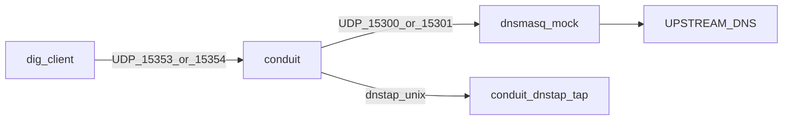

# Manual IPv4/IPv6 forwarding test guide

> **Temporary lab document.** Lives in the DNSConduit repo for hands-on validation of phase 1b
> egress (IPv4/IPv6 sources, cross-family upstream, Rhai `set_source_v6`). Relocate or remove
> before v1 if you prefer docs only in DNSConduitCursor.

Set your real resolver once per shell session:

```bash
export UPSTREAM_DNS=<your dns server ip>
```

All commands below assume the **repository root** as the current working directory.

## Table of contents

1. [What this exercises](#what-this-exercises)
2. [Prerequisites](#prerequisites)
3. [Port map](#port-map)
4. [Pre-flight](#pre-flight)
5. [Three-terminal workflow](#three-terminal-workflow)
6. [Shared dnstap configuration](#shared-dnstap-configuration)
7. [Scenarios](#scenarios)
8. [Inspecting dnstap output](#inspecting-dnstap-output)
9. [Suggested run order](#suggested-run-order)
10. [Troubleshooting](#troubleshooting)
11. [Related CI fixtures](#related-ci-fixtures)

## What this exercises

- **IPv4 egress** — `forward.sources_v4` / pool overrides; bind `127.0.0.1` for upstream UDP.
- **IPv6 egress** — `forward.sources_v6` / pool overrides; bind `::1` for upstream UDP.
- **Cross-family** — IPv4 client to IPv6 backend (and reverse); egress socket family follows the backend.
- **Default bind** — no `sources_v6`; OS default `[::]:0` egress.
- **Rhai** — `txn.set_source_v6("::1")` in request phase (allowed-set validation, fail-open).
- **Observation** — dnstap client query/response frames with pool/backend metadata.

Upstream path for every scenario: **dig → Conduit → dnsmasq (loopback mock) → `$UPSTREAM_DNS`**.

## Prerequisites

| Tool | Purpose |
|------|---------|
| `dig` | Send test queries (bind9-utils) |
| `dnsmasq` | Loopback upstream mock forwarding to `$UPSTREAM_DNS` |
| `jq` | Optional: filter dnstap JSON on stdout |
| `ss` | Port checks (used by `check-ports.sh`) |

Build binaries:

```bash
cargo build -p conduit -p conduit-dnstap-tracer --release
# target/release/conduit
# target/release/conduit-dnstap-tracer
```

Loopback IPv6:

```bash
ping -c1 ::1
```

## Port map

Lab ports intentionally **avoid UDP 5353** (standard mDNS). Chrome, Avahi, and others often bind
`0.0.0.0:5353` / `[::]:5353`, which prevents Conduit from using the same port even on `127.0.0.1`.

| Role | Address |
|------|---------|
| Conduit — IPv4 clients | `127.0.0.1:15353` |
| Conduit — IPv6 clients | `[::1]:15354` |
| dnsmasq — IPv4 upstream mock | `127.0.0.1:15300` → `$UPSTREAM_DNS` |
| dnsmasq — IPv6 upstream mock | `[::1]:15301` → `$UPSTREAM_DNS` |
| dnstap collector socket | `unix:/tmp/conduit-manual-dnstap.sock` |
| Conduit control API (gRPC) | `127.0.0.1:15199` (TCP) |

Config files: [`tests/manual/config/`](config/).

## Pre-flight

```bash
chmod +x tests/manual/scripts/check-ports.sh
tests/manual/scripts/check-ports.sh
```

All lab ports must report **free** before starting dnsmasq or Conduit. The script also notes
whether **5353** is in use (informational).

After Conduit starts, confirm binds:

```bash
ss -ulnp | grep -E '15353|15354|15300|15301'
```

Conduit logs a **dataplane startup summary** (generation, pools, egress sources, event sinks)
and one line per bound listener, e.g. `Starting listening on 127.0.0.1:15353 udp`.

## Three-terminal workflow



**Terminal A — dnstap collector** (start first; Conduit connects as a client):

```bash
rm -f /tmp/conduit-manual-dnstap.sock
target/release/conduit-dnstap-tracer -u /tmp/conduit-manual-dnstap.sock -f json
```

**Terminal B — dnsmasq** (see each scenario; v4 and/or v6):

`--log-facility=-` sends query logs to **stderr** in this terminal (without it, `--log-queries`
goes to syslog only).

```bash
# IPv4 upstream mock
dnsmasq -k -p 15300 --listen-address=127.0.0.1 \
  --no-resolv --server="$UPSTREAM_DNS" --log-queries --log-facility=-

# IPv6 upstream mock (second terminal when needed)
dnsmasq -k -p 15301 --listen-address=::1 \
  --no-resolv --server="$UPSTREAM_DNS" --log-queries --log-facility=-
```

**Terminal C — Conduit** (one config per scenario):

```bash
target/release/conduit tests/manual/config/<scenario>.yaml
```

The first argument must be the **YAML config only** — not the `conduit` binary path. Wrong:

```bash
# BAD: reads the ELF binary as config → "stream did not contain valid UTF-8"
target/release/conduit target/release/conduit tests/manual/config/01-v4-only.yaml
```

Use a **unique QNAME** per test so dnstap lines are easy to find.

## Shared dnstap configuration

Every file under `tests/manual/config/` includes:

```yaml
events:
  queue_depth: 8192
  drop_policy: drop_oldest
  sinks:
    - type: dnstap
      name: manual
      export_id: manual-ipv6
      destinations:
        - "unix:/tmp/conduit-manual-dnstap.sock"
      emit:
        - query
        - response
      extra_fields:
        - pool
        - backend
        - attempt_count
```

**dnstap client leg:** `socket_family` is `INET` for IPv4 clients and `INET6` for IPv6 clients
(based on the client socket, not the upstream). **dnsmasq logs** show the **upstream** source
address Conduit used (`127.0.0.1` or `::1` when pinned).

## Scenarios

### Scenario 1 — IPv4 only

**Proves:** v4 listener, `sources_v4`, v4 backend; no IPv6 in config.

| Item | Value |
|------|-------|
| Config | [`config/01-v4-only.yaml`](config/01-v4-only.yaml) |
| dnsmasq | v4 only (`15300`) |
| Conduit | `target/release/conduit tests/manual/config/01-v4-only.yaml` |

**dig:**

```bash
dig @127.0.0.1 -p 15353 +time=3 +tries=1 +short manual-v4-01.example.com A
```

**Expect:**

- Answer records (via `$UPSTREAM_DNS`).
- dnstap: `socket_family` **INET**, `query_address` **127.0.0.1**; `extra.pool` **v4**,
  `extra.backend` **127.0.0.1:15300**.
- dnsmasq: query from **127.0.0.1** (ephemeral source port).

---

### Scenario 2 — IPv6 only

**Proves:** v6 listener, `sources_v6`, v6 backend.

| Item | Value |
|------|-------|
| Config | [`config/02-v6-only.yaml`](config/02-v6-only.yaml) |
| dnsmasq | v6 only (`15301`) |
| Conduit | `target/release/conduit tests/manual/config/02-v6-only.yaml` |

**dig:**

```bash
dig @::1 -p 15354 +time=3 +tries=1 +short manual-v6-02.example.com A
```

**Expect:**

- dnstap: **INET6**, client **::1**; pool **v6**, backend **[::1]:15301**.
- dnsmasq: source **::1**.

**Negative** (no v4 listener in this config):

```bash
dig @127.0.0.1 -p 15354 +time=1 +tries=1 manual-v6-02.example.com A
```

Should fail (timeout / connection refused).

---

### Scenario 3 — Dual-stack, native IPv4 path

**Proves:** Both families configured; QNAME routing sends traffic to the v4 pool/backend.

| Item | Value |
|------|-------|
| Config | [`config/03-dual.yaml`](config/03-dual.yaml) |
| dnsmasq | **both** v4 (`15300`) and v6 (`15301`) |
| Conduit | `target/release/conduit tests/manual/config/03-dual.yaml` |

**dig:**

```bash
dig @127.0.0.1 -p 15353 +time=3 +tries=1 +short test.v4.manual.example.com A
```

**Expect:**

- dnstap: **INET**; `extra.pool` **v4**; `extra.backend` **127.0.0.1:15300**.
- dnsmasq on **15300** receives the query; **15301** should not.

---

### Scenario 4 — Dual-stack, native IPv6 path

Same config as scenario 3.

**dig:**

```bash
dig @::1 -p 15354 +time=3 +tries=1 +short test.v6.manual.example.com A
```

**Expect:**

- dnstap: **INET6**; `extra.pool` **v6**; `extra.backend` **[::1]:15301**.
- dnsmasq on **15301** sees source **::1**.

---

### Scenario 5 — Cross-family: IPv4 client → IPv6 upstream

**Proves:** Client connects over IPv4; backend is IPv6; egress uses v6 socket + `sources_v6`.

| Item | Value |
|------|-------|
| Config | [`config/05-v4-client-v6-upstream.yaml`](config/05-v4-client-v6-upstream.yaml) |
| dnsmasq | v6 only (`15301`) |
| Conduit | `target/release/conduit tests/manual/config/05-v4-client-v6-upstream.yaml` |

**dig:**

```bash
dig @127.0.0.1 -p 15353 +time=3 +tries=1 +short manual-xfam-05.example.com A
```

**Expect:**

- dnstap: client leg still **INET** / **127.0.0.1**.
- dnsmasq on **[::1]:15301** receives query with source **::1** (not v4).

---

### Scenario 6 — Cross-family: IPv6 client → IPv4 upstream

**Proves:** Client over IPv6; backend is IPv4; egress uses v4 socket + `sources_v4`.

| Item | Value |
|------|-------|
| Config | [`config/06-v6-client-v4-upstream.yaml`](config/06-v6-client-v4-upstream.yaml) |
| dnsmasq | v4 only (`15300`) |
| Conduit | `target/release/conduit tests/manual/config/06-v6-client-v4-upstream.yaml` |

**dig:**

```bash
dig @::1 -p 15354 +time=3 +tries=1 +short manual-xfam-06.example.com A
```

**Expect:**

- dnstap: **INET6** / **::1**.
- dnsmasq on **127.0.0.1:15300** sees source **127.0.0.1**.

---

### Scenario 7 — IPv6 upstream, no `sources_v6` (OS default bind)

**Proves:** v6 backend without pinned sources; Conduit uses default `[::]:0` egress.

| Item | Value |
|------|-------|
| Config | [`config/07-v6-default-bind.yaml`](config/07-v6-default-bind.yaml) |
| dnsmasq | v6 only (`15301`) |
| Conduit | `target/release/conduit tests/manual/config/07-v6-default-bind.yaml` |

**dig:**

```bash
dig @::1 -p 15354 +time=3 +tries=1 +short manual-v6-07.example.com A
```

**Expect:**

- Query still succeeds.
- dnsmasq source address may **differ** from scenario 2 (not pinned to **::1**). Compare logs
  side-by-side with scenario 2.

---

### Scenario 8 — Rhai `set_source_v6`

**Proves:** Request-phase script pins IPv6 egress when address is in the allowed set.

| Item | Value |
|------|-------|
| Config | [`config/08-rhai-set-source-v6.yaml`](config/08-rhai-set-source-v6.yaml) |
| Script | [`tests/fixtures/rhai/set-source-v6.rhai`](../fixtures/rhai/set-source-v6.rhai) |
| dnsmasq | v6 only (`15301`) |
| Conduit | `target/release/conduit tests/manual/config/08-rhai-set-source-v6.yaml` |

**dig** (IPv4 client; upstream still v6):

```bash
dig @127.0.0.1 -p 15353 +time=3 +tries=1 +short manual-rhai-08.example.com A
```

**Expect:**

- dnstap: client **INET** / **127.0.0.1**.
- dnsmasq on v6: source **::1** (script calls `txn.set_source_v6("::1")`).

**Optional negative:** Edit the script to `txn.set_source_v6("2001:db8::1");` (not in allowed set).
Override is ignored (fail-open); behavior should resemble scenario 7, not a hard failure.

---

## Inspecting dnstap output

With Terminal A on `-f json`, each frame is one JSON object per line. Example filter:

```bash
# In another terminal, if you re-run tap with tee:
# target/release/conduit-dnstap-tracer -u /tmp/conduit-manual-dnstap.sock -f json | tee /tmp/dnstap.jsonl

jq -c 'select(.qname | test("manual")) | {
  qname,
  mnemonic,
  socket_family,
  query_address,
  extra
}' /tmp/dnstap.jsonl
```

Log format (`-f log`) prints `client=` and `proto=` on the first line of each frame.

## Suggested run order

1. Scenario 1 — IPv4 baseline  
2. Scenario 2 — IPv6 baseline  
3. Scenarios 3 and 4 — dual-stack routing  
4. Scenarios 5 and 6 — cross-family  
5. Scenario 7 — default v6 bind vs scenario 2  
6. Scenario 8 — Rhai override  

Re-run `tests/manual/scripts/check-ports.sh` if you stop processes mid-session.

## Troubleshooting

| Symptom | Likely cause |
|---------|----------------|
| `stream did not contain valid UTF-8` | Config path is wrong — often the **binary** was passed as the first arg instead of the `.yaml` file. Use `target/release/conduit tests/manual/config/01-v4-only.yaml` (one path after `conduit`). |
| `config invalid` on start | YAML typo; fix paths or run validation (see below). |
| Conduit exits on bind | Port in use — run `check-ports.sh`; stop Chrome mDNS only if you switched back to 5353. |
| No dnstap output | Start **conduit-dnstap-tracer** before Conduit; socket path must match configs. |
| dig times out | Wrong listener/port; Conduit not running; dnsmasq not running for that backend family. |
| dig OK, dnsmasq silent | Wrong pool (check `extra.pool` / QNAME suffix in scenario 3–4), or logs in syslog if `--log-facility=-` was omitted (`journalctl -f \| grep dnsmasq`). |
| `dig @::1` fails | IPv6 disabled on host (`ping ::1` first). |
| Rhai script error | Path in config is relative to the config file directory; keep `08` config unchanged or fix `value:` path. |

Validate configs without starting the server:

```bash
for f in tests/manual/config/*.yaml; do
  echo "== $f =="
  cargo run -p conduit -- "$f" 2>&1 | head -1 || true
done
```

(Starting `conduit` loads and validates; stop immediately with Ctrl+C after `dataplane listeners started`.)

## Related CI fixtures

Automated tests use the same behavior on different ports:

| Manual config | CI fixture |
|---------------|------------|
| IPv4 sources | [`tests/fixtures/config/forward-sources-v4.yaml`](../fixtures/config/forward-sources-v4.yaml) |
| IPv6 sources | [`tests/fixtures/config/forward-sources-v6.yaml`](../fixtures/config/forward-sources-v6.yaml) |
| Rhai v6 source | [`tests/fixtures/config/with-rhai-set-source-v6.yaml`](../fixtures/config/with-rhai-set-source-v6.yaml) |
| dnstap extras | [`tests/fixtures/config/with-dnstap-extra.yaml`](../fixtures/config/with-dnstap-extra.yaml) |

Pipeline tests: `forward_source_v4.rs`, `forward_source_v6.rs` in `crates/conduit-dataplane/tests/`.
